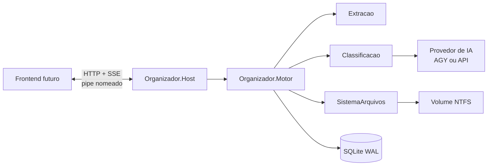
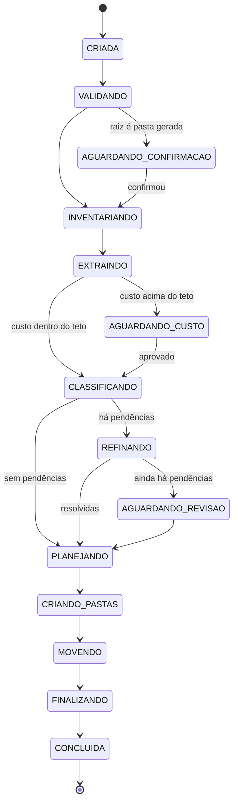
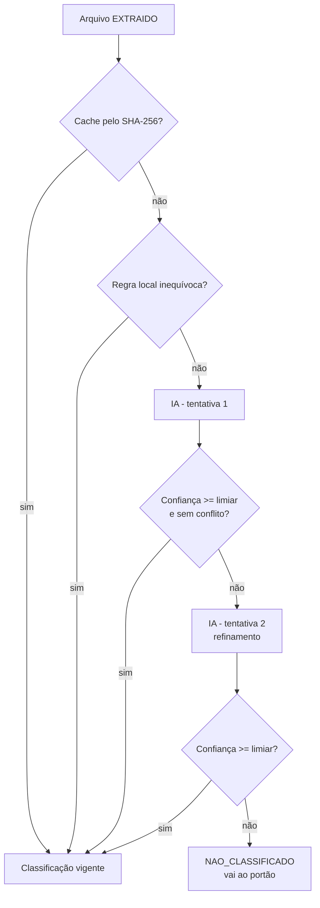
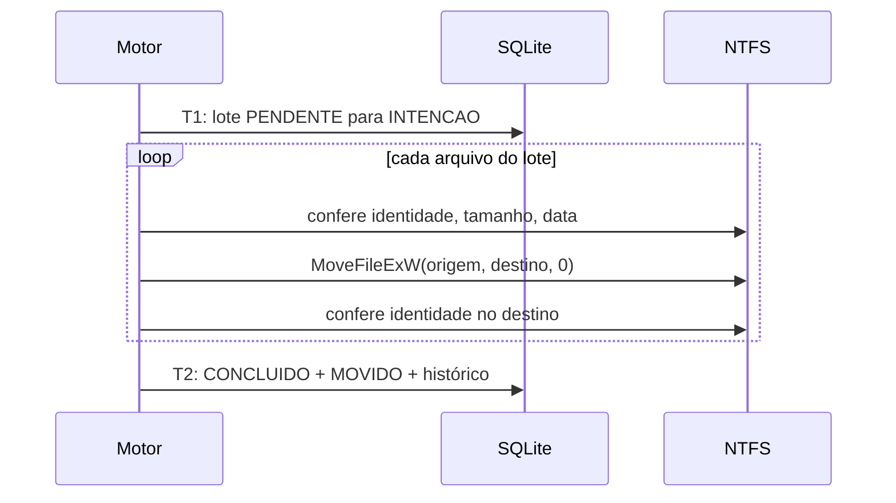

# Organizador de Pastas — Especificação Técnica do Backend

Sep 24, 2026 · @Alexandre Chagas Sousa

## 1. Visão geral e escopo

O backend recebe uma pasta, lê o conteúdo de cada arquivo solto nela, classifica cada um pelo assunto, cria no máximo dois níveis de subpastas e move os arquivos para elas. Registra cada passo e retoma sozinho após queda de energia ou reinício do Windows.

O pipeline tem sete etapas em ordem fixa. Nenhuma etapa começa antes de a anterior terminar para todos os arquivos.


O histórico de movimentos (seção 14) e o controle de retomada (seção 6) atravessam todas as etapas.

### Dentro do escopo

- Motor de organização sem interface (headless), acionado por comandos e emissor de eventos de progresso.
- Leitura profunda de conteúdo: texto, OCR, metadados, imagens e documentos fiscais brasileiros.
- Classificação por conteúdo via API de IA, com regras locais determinísticas antes da IA.
- Persistência local de estado, classificações, plano de pastas e histórico.
- Retomada exata do ponto de parada após qualquer interrupção.
- Contrato de comandos e eventos para o frontend futuro.

### Fora do escopo desta especificação

- Interface visual. Será especificada à parte; o backend já emite tudo o que ela vai precisar exibir.
- Desfazer uma execução. O histórico guarda o necessário, mas a função fica para uma fase posterior.
- Organizar, renomear ou mover subpastas existentes e seus conteúdos.
- Renomear arquivos, apagar duplicados ou alterar conteúdo.
- Pastas de rede (caminhos `\\servidor\...`) e volumes FAT32/exFAT na versão 1 (motivo na seção 7).

### Glossário

| Termo | Significado |
| --- | --- |
| Raiz | A pasta que o usuário forneceu para organizar. |
| Arquivo solto | Arquivo que está diretamente na raiz, fora de qualquer subpasta. |
| Nível 1 | Subpasta criada diretamente dentro da raiz (ex.: `Faturas`). |
| Nível 2 | Subpasta criada dentro de uma pasta de nível 1 (ex.: `Faturas\2026-01`). |
| Pasta gerada | Pasta de nível 1 ou 2 criada pelo próprio app em alguma execução. |
| Marcador | Arquivo oculto que o app grava dentro de cada pasta gerada para reconhecê-la depois. |
| Execução | Uma rodada completa do pipeline sobre uma raiz, com identificador único (GUID). |
| Classificação | Categoria, subcategoria, atributos extraídos e confiança atribuídos a um arquivo. |
| Confiança | Número de 0,00 a 1,00 que diz quão segura é a classificação. |
| Portão de revisão | Ponto entre classificar e mover em que as pendências são mostradas. |
| Plano de pastas | Lista persistida das pastas que serão criadas, antes de criar qualquer uma. |
| Movimento | Registro de um arquivo saindo da raiz para uma pasta gerada. |
| Identidade do arquivo | Número de série do volume + ID de arquivo NTFS; não muda quando o arquivo é renomeado ou movido no mesmo volume. |

## 2. Regras invioláveis

Treze regras valem para todas as etapas e todas as versões; nenhuma configuração pode desativá-las. Cada regra é garantida em dois pontos independentes (planejamento e execução), para que um erro de lógica num deles não viole a regra.

Princípio de falha segura: se o motor detectar em tempo de execução que uma ação violaria uma regra, ele interrompe a execução no estado `FALHOU`, grava o motivo no histórico e não tenta contornar.

| ID | Regra | Como é garantida |
| --- | --- | --- |
| R-01 | Só organiza arquivos soltos diretamente na raiz. | Enumeração somente do nível superior (`TopDirectoryOnly`). Antes de cada movimento, o executor confere que a pasta de origem é exatamente a raiz. |
| R-02 | Nunca organiza subpastas: não move, renomeia, apaga nem lê o conteúdo de subpastas existentes ou de seus arquivos. | Subpastas são ignoradas no inventário. O executor só escreve dentro de pastas que ele mesmo criou (seção 12). |
| R-03 | Cria no máximo dois níveis de pastas abaixo da raiz. Nunca um terceiro. | Validado no planejador, no executor e por restrição `CHECK (nivel IN (1,2))` no banco. |
| R-04 | Todo movimento e toda pasta criada ficam no histórico. | Registro de intenção gravado e confirmado em disco antes da ação. Tabela de histórico só aceita inserção (gatilhos bloqueiam `UPDATE` e `DELETE`). |
| R-05 | Raiz que é pasta gerada pelo app, ou está dentro de uma, exige aviso e confirmação explícita. | A execução para em `AGUARDANDO_CONFIRMACAO` antes do inventário. Sem confirmação, nada é lido. |
| R-06 | Todos os arquivos são classificados antes de qualquer pasta ser criada. | A etapa 6 só inicia quando 100% dos arquivos inventariados têm estado final de classificação. |
| R-07 | Todas as pastas do plano existem antes do primeiro movimento. | A etapa 7 só inicia quando cada pasta planejada está `CRIADA` ou `REUTILIZADA` e verificada no disco. |
| R-08 | Nunca sobrescreve um arquivo existente. | Movimento sem a opção de substituir. Colisão de nome gera novo nome com sufixo (seção 13). |
| R-09 | Nunca apaga arquivo do usuário. | O único item que o app apaga é pasta gerada vazia criada por ele (e o marcador dela). |
| R-10 | Movimento é sempre renomeação no mesmo volume, nunca cópia seguida de exclusão. | Destino sempre abaixo da raiz. O executor confere que origem e destino têm o mesmo número de série de volume. |
| R-11 | Após qualquer interrupção, cada arquivo está em exatamente um lugar: origem ou destino planejado. | Registro de intenção antes do movimento e reconciliação na retomada (seção 6). |
| R-12 | Nunca segue nem move links simbólicos, junções ou pontos de montagem. | Itens cujo ponto de reanálise é substituto de nome (links simbólicos e junções, testado com `IsReparseTagNameSurrogate`) são excluídos no inventário, com motivo registrado. Arquivos do OneDrive também são pontos de reanálise, mas não são links e seguem normalmente. |
| R-13 | Uma única execução ativa por raiz, e nunca duas execuções ativas em raízes aninhadas. | Trava persistida no banco + mutex nomeado do Windows. Raiz ancestral ou descendente de raiz ativa é recusada. |

## 3. Decisões e ambiguidades resolvidas

O pedido tem um conflito direto: a regra proíbe o terceiro nível, mas o exemplo `faturas\pdf\vencimento_Jan_2026\` tem três níveis. A regra prevalece (D-01); as demais decisões abaixo fecham pontos que o pedido deixou em aberto.

### D-01 — Profundidade máxima contra o exemplo de três níveis

O nível de formato (`pdf`) sai do caminho, porque o próprio pedido diz que o formato não importa, e sim o conteúdo. O exemplo passa a ser `Faturas\Vencimento_2026-01\arquivo.pdf`.

Se o formato precisar aparecer, ele entra no nome do nível 2, nunca como nível extra: `Faturas\PDF_Vencimento_2026-01\`. Isso é uma opção do modelo de nomes (seção 12), desligada por padrão.

### D-02 — Datas no nome da pasta

O nível 2 usa `AAAA-MM` em vez de `Jan_2026`. Com o mês por extenso, o Explorer ordena `Abr, Ago, Dez, Fev, Jan`; com `2026-01`, a ordem alfabética é a cronológica. O rótulo da data vem antes (`Vencimento_`, `Emissão_`, `Pagamento_`), no mesmo estilo do exemplo pedido.

### Demais decisões

| ID | Tema | Decisão | Motivo |
| --- | --- | --- | --- |
| D-03 | Linguagem | C# em .NET 10 (versão LTS), backend sem interface. | Acesso nativo às APIs de arquivo do Windows (ID de arquivo NTFS, renomeação atômica, OCR do Windows, Gerenciador de Credenciais), SDK oficial da Anthropic para C#, e já compila com o `mkfile` existente. |
| D-04 | IA de classificação | Provedor de IA plugável. Padrão em casa: AGY (Google Antigravity CLI), sem custo por chamada. Alternativa: API do Claude (`claude-opus-5`), informada depois pela tela de configuração. | O uso inicial é só doméstico, onde a AGY já está instalada e logada. Para distribuir, a API tem custo previsível e não depende de ferramenta instalada. Detalhes na seção 10. |
| D-05 | Arquivos não classificados | Depois de uma segunda tentativa automática, ficam soltos na raiz, sem mover. | É o destino mais seguro e reversível; a próxima execução tenta de novo. O portão segue sozinho após o tempo limite (seção 11). |
| D-06 | Pasta do usuário com o mesmo nome de uma categoria | O app nunca escreve nela. Cria `Faturas (Organizador)` ao lado. | Escrever na pasta do usuário seria mexer numa subpasta que não é dele (R-02). |
| D-07 | Segunda execução na mesma raiz | Reutiliza as pastas geradas antes, reconhecidas pelo marcador. | Evita `Faturas` e `Faturas (2)` duplicadas entre execuções. |
| D-08 | Arquivos do OneDrive somente online | Não baixa por padrão; classifica pelo nome e pelos metadados, o que tende a mandá-los para o portão. | Baixar gigabytes sem pedir é caro e lento. Configurável. |
| D-09 | Sistemas de arquivos aceitos | Somente NTFS e ReFS locais na versão 1. | FAT32 e exFAT não têm ID de arquivo estável, e a retomada segura depende dele (seção 6). |
| D-10 | Tipo de processo | Processo do usuário logado, não serviço do Windows. | Um serviço roda em outra conta e não enxerga OneDrive, unidades mapeadas nem as credenciais do usuário. |
| D-11 | Taxonomia | Lista fechada de categorias. Categoria nova proposta pela IA só vira pasta se tiver pelo menos 3 arquivos. | Impede uma pasta por arquivo e nomes inconsistentes entre execuções. |
| D-12 | Arquivos duplicados (mesmo SHA-256) | Movidos normalmente, com sufixo de nome; marcados no relatório; nunca apagados. | R-09 proíbe apagar arquivo do usuário. |

## 4. Arquitetura e stack

O backend é um executável .NET 10 que roda na conta do usuário, guarda tudo num banco SQLite local e expõe comandos e eventos por um pipe nomeado. O frontend futuro, qualquer que seja a tecnologia dele, só conversa com esse contrato (seção 15).



O motor é o único componente que muda estado. Extração e classificação só leem arquivos; somente `SistemaArquivos` cria pastas e move arquivos, e somente quando o motor manda.

### Projetos da solução

| Projeto | Responsabilidade | Depende de |
| --- | --- | --- |
| `Organizador.Dominio` | Entidades, regras R-01 a R-13, máquina de estados, taxonomia, modelo de nomes. Sem nenhum acesso a disco ou rede. | nada |
| `Organizador.Persistencia` | Esquema SQLite, migrações versionadas, repositórios, transações. | Dominio |
| `Organizador.SistemaArquivos` | Enumeração, ID de arquivo NTFS, movimento atômico, marcadores, validação de caminhos, atributos de nuvem. | Dominio |
| `Organizador.Extracao` | Um extrator por família de formato, executado em processo filho isolado (seção 9); devolve texto, metadados e imagens de página. | Dominio |
| `Organizador.Classificacao` | Detectores determinísticos (boleto, NF-e, PIX), cliente da IA, cache por hash. | Dominio |
| `Organizador.Motor` | Orquestra as sete etapas, checkpoints, retomada, emissão de eventos. | todos acima |
| `Organizador.Host` | Executável: inicialização, API por pipe nomeado, logs, instância única, retomada no logon. | Motor |
| `Organizador.Testes.*` | Unitários, integração em disco real, testes de queda (seção 18). | todos |

`TargetFramework`: `net10.0-windows10.0.19041.0`, necessário para o OCR nativo do Windows. Compilação pelo `mkfile` (`mkfile d` e `mkfile r` sobre o `.sln`).

### Bibliotecas

Todas têm licença que permite uso em produto fechado. Nenhuma baixa arquivos da internet em tempo de execução.

| Finalidade | Biblioteca | Licença |
| --- | --- | --- |
| API do Claude | `Anthropic` (SDK oficial, NuGet) | MIT |
| Banco de dados | `Microsoft.Data.Sqlite` + `Dapper` | MIT / Apache-2.0 |
| Chamadas Win32 (ID de arquivo, movimento, volume, credenciais) | `Microsoft.Windows.CsWin32` (gerador de código) | MIT |
| Texto de PDF | `UglyToad.PdfPig` | Apache-2.0 |
| Renderizar página de PDF em imagem | `PDFtoImage` (PDFium) | MIT |
| OCR local | `Windows.Media.Ocr` (nativo do Windows 10/11) | sistema |
| Word, Excel, PowerPoint modernos | `DocumentFormat.OpenXml` | MIT |
| Word e Excel antigos (`.doc`, `.xls`) | `NPOI` | Apache-2.0 |
| HTML | `AngleSharp` | MIT |
| E-mail `.eml` / `.msg` | `MimeKit` / `MsgReader` | MIT / MIT |
| Metadados de foto (EXIF, GPS, câmera) | `MetadataExtractor` | Apache-2.0 |
| Redimensionar imagem para a IA | `SkiaSharp`; HEIC via `Windows.Graphics.Imaging` | MIT / sistema |
| Metadados de áudio e vídeo | `TagLibSharp` | LGPL-2.1 (ligação dinâmica) |
| Listar conteúdo de `.zip`, `.rar`, `.7z` sem extrair | `SharpCompress` | MIT |
| Políticas de nova tentativa | `Polly` | BSD-3-Clause |
| Logs estruturados | `Serilog` + `Serilog.Sinks.File` | Apache-2.0 |
| API local | ASP.NET Core (Kestrel em pipe nomeado, SSE nativo do .NET 10) | MIT |

### Concorrência

- Extração: até `min(núcleos, 8)` arquivos em paralelo, por fila limitada (`System.Threading.Channels`).
- Classificação pela IA: 4 chamadas simultâneas por padrão, reduzidas automaticamente ao receber HTTP 429.
- Criação de pastas e movimentos: uma única thread, em ordem. Renomear no mesmo volume leva milissegundos; paralelizar só complicaria a retomada.

### Onde os dados ficam

| Caminho | Conteúdo |
| --- | --- |
| `%LOCALAPPDATA%\OrganizadorDePastas\dados\organizador.db` | Banco único: execuções, arquivos, classificações, plano, movimentos, histórico, cache. |
| `%LOCALAPPDATA%\OrganizadorDePastas\logs\` | Logs diários, 30 dias de retenção. |
| `%LOCALAPPDATA%\OrganizadorDePastas\config.json` | Configuração (seção 16). Nunca contém a chave da API. |
| Gerenciador de Credenciais do Windows | Chave da API, alvo `OrganizadorDePastas/ClaudeApiKey`. |
| Dentro de cada pasta gerada | Marcador oculto `.organizador` (seção 12). |

### Inicialização e retomada automática

A instalação registra uma tarefa no Agendador de Tarefas, disparada no logon do usuário, que roda `Organizador.Host.exe --retomar`. Se não houver execução inacabada, o processo encerra em menos de 1 segundo; se houver, retoma sem intervenção (seção 6). Um mutex nomeado por usuário garante uma única instância do host.

## 5. Modelo de dados e persistência

Um único arquivo SQLite em modo WAL com `synchronous=FULL` guarda todo o estado: cada transação confirmada sobrevive a queda de energia. Toda mudança de estado de um item e o registro correspondente no histórico entram na mesma transação.

### Configuração da conexão

| PRAGMA | Valor | Por quê |
| --- | --- | --- |
| `journal_mode` | `WAL` | Leitores (API, frontend) não bloqueiam o motor que escreve. |
| `synchronous` | `FULL` | Em WAL, `NORMAL` pode perder as últimas transações numa queda de energia; `FULL` força gravação física a cada confirmação. |
| `foreign_keys` | `ON` | Integridade referencial entre tabelas. |
| `busy_timeout` | `5000` | Espera até 5 s por trava antes de falhar. |
| `user_version` | número da migração | Controle de versão do esquema. |

Antes de cada migração de esquema, o host faz `VACUUM INTO` para uma cópia datada. A migração roda numa transação única; se falhar, o banco fica como estava.

### Convenções

- Datas: texto ISO 8601 em UTC com milissegundos (`2026-09-24T14:05:31.207Z`).
- Identidade de arquivo e pasta: `volume_serial` (64 bits) + `file_id` (16 bytes), lidos de `FILE_ID_INFO`. Funciona em NTFS e ReFS.
- Estados: texto em maiúsculas, validado por `CHECK`.
- Texto extraído guardado: no máximo 12.000 caracteres por arquivo, o mesmo trecho enviado à IA.

### Esquema

```sql
CREATE TABLE raiz (
  id               INTEGER PRIMARY KEY,
  caminho          TEXT    NOT NULL,
  volume_serial    INTEGER NOT NULL,
  file_id          BLOB    NOT NULL,
  sistema_arquivos TEXT    NOT NULL CHECK (sistema_arquivos IN ('NTFS','ReFS')),
  criada_em        TEXT    NOT NULL,
  UNIQUE (volume_serial, file_id)
);

CREATE TABLE execucao (
  id                    TEXT    PRIMARY KEY,
  raiz_id               INTEGER NOT NULL REFERENCES raiz(id),
  estado                TEXT    NOT NULL CHECK (estado IN (
                          'CRIADA','VALIDANDO','AGUARDANDO_CONFIRMACAO','INVENTARIANDO',
                          'EXTRAINDO','AGUARDANDO_CUSTO','CLASSIFICANDO','REFINANDO','AGUARDANDO_REVISAO',
                          'PLANEJANDO','CRIANDO_PASTAS','MOVENDO','FINALIZANDO',
                          'CONCLUIDA','PAUSADA','CANCELADA','FALHOU')),
  estado_antes_pausa    TEXT,
  confirmada_pelo_usuario_em TEXT,
  config_json           TEXT    NOT NULL,
  versao_app            TEXT    NOT NULL,
  versao_taxonomia      INTEGER NOT NULL,
  versao_prompt         INTEGER NOT NULL,
  dono_pid              INTEGER,
  dono_inicio_processo  TEXT,
  heartbeat_em          TEXT,
  portao_expira_em      TEXT,
  criada_em             TEXT    NOT NULL,
  atualizada_em         TEXT    NOT NULL,
  encerrada_em          TEXT,
  motivo_falha          TEXT
);

CREATE TABLE arquivo (
  id              INTEGER PRIMARY KEY,
  execucao_id     TEXT    NOT NULL REFERENCES execucao(id),
  nome            TEXT    NOT NULL,
  tamanho         INTEGER NOT NULL,
  criado_fs       TEXT    NOT NULL,
  modificado_fs   TEXT    NOT NULL,
  atributos       INTEGER NOT NULL,
  volume_serial   INTEGER NOT NULL,
  file_id         BLOB    NOT NULL,
  sha256          BLOB,
  extensao        TEXT    NOT NULL,
  formato_real    TEXT,
  somente_nuvem   INTEGER NOT NULL DEFAULT 0,
  estado          TEXT    NOT NULL CHECK (estado IN (
                    'INVENTARIADO','EXCLUIDO','EXTRAIDO','FALHA_EXTRACAO',
                    'CLASSIFICADO','NAO_CLASSIFICADO','MOVIDO','MANTIDO_NA_RAIZ',
                    'ALTERADO','DESAPARECIDO')),
  motivo          TEXT,
  UNIQUE (execucao_id, nome),
  UNIQUE (execucao_id, volume_serial, file_id)
);

CREATE TABLE extracao (
  arquivo_id      INTEGER PRIMARY KEY REFERENCES arquivo(id),
  metodo          TEXT    NOT NULL,
  texto           TEXT,
  paginas_total   INTEGER,
  paginas_lidas   INTEGER,
  idioma          TEXT,
  metadados_json  TEXT    NOT NULL,
  sinais_json     TEXT    NOT NULL,
  usa_imagem      INTEGER NOT NULL DEFAULT 0,
  duracao_ms      INTEGER NOT NULL,
  erro            TEXT
);

CREATE TABLE classificacao (
  id                   INTEGER PRIMARY KEY,
  arquivo_id           INTEGER NOT NULL REFERENCES arquivo(id),
  tentativa            INTEGER NOT NULL CHECK (tentativa BETWEEN 1 AND 3),
  fonte                TEXT    NOT NULL CHECK (fonte IN ('REGRA','IA','CACHE','USUARIO')),
  categoria            TEXT,
  subcategoria         TEXT,
  atributos_json       TEXT    NOT NULL,
  confianca            REAL    NOT NULL CHECK (confianca BETWEEN 0 AND 1),
  justificativa        TEXT,
  provedor             TEXT,
  modelo               TEXT,
  tokens_entrada       INTEGER,
  tokens_saida         INTEGER,
  tokens_cache_leitura INTEGER,
  custo_estimado_usd   REAL,
  id_requisicao        TEXT,
  vigente              INTEGER NOT NULL DEFAULT 1,
  criada_em            TEXT    NOT NULL
);
CREATE UNIQUE INDEX ux_classificacao_vigente ON classificacao(arquivo_id) WHERE vigente = 1;

CREATE TABLE cache_classificacao (
  sha256            BLOB    NOT NULL,
  versao_taxonomia  INTEGER NOT NULL,
  versao_prompt     INTEGER NOT NULL,
  modelo            TEXT    NOT NULL,
  resultado_json    TEXT    NOT NULL,
  provedor          TEXT    NOT NULL,
  criada_em         TEXT    NOT NULL,
  PRIMARY KEY (sha256, versao_taxonomia, versao_prompt, provedor, modelo)
);

CREATE TABLE pasta_gerada (
  id                  INTEGER PRIMARY KEY,
  raiz_id             INTEGER NOT NULL REFERENCES raiz(id),
  marcador_guid       TEXT    NOT NULL UNIQUE,
  nivel               INTEGER NOT NULL CHECK (nivel IN (1,2)),
  pai_id              INTEGER REFERENCES pasta_gerada(id),
  nome                TEXT    NOT NULL,
  caminho_relativo    TEXT    NOT NULL,
  volume_serial       INTEGER NOT NULL,
  file_id             BLOB    NOT NULL,
  criada_por_execucao TEXT    NOT NULL REFERENCES execucao(id),
  criada_em           TEXT    NOT NULL,
  removida_em         TEXT,
  CHECK ((nivel = 1 AND pai_id IS NULL) OR (nivel = 2 AND pai_id IS NOT NULL))
);

CREATE TABLE pasta_planejada (
  id                 INTEGER PRIMARY KEY,
  execucao_id        TEXT    NOT NULL REFERENCES execucao(id),
  nivel              INTEGER NOT NULL CHECK (nivel IN (1,2)),
  pai_planejada_id   INTEGER REFERENCES pasta_planejada(id),
  nome               TEXT    NOT NULL,
  caminho_relativo   TEXT    NOT NULL,
  categoria          TEXT    NOT NULL,
  subcategoria       TEXT,
  estado             TEXT    NOT NULL CHECK (estado IN (
                       'PLANEJADA','CRIADA','REUTILIZADA','FALHOU','REMOVIDA_VAZIA')),
  marcador_guid      TEXT    NOT NULL UNIQUE,
  pasta_gerada_id    INTEGER REFERENCES pasta_gerada(id),
  UNIQUE (execucao_id, caminho_relativo),
  CHECK ((nivel = 1 AND pai_planejada_id IS NULL) OR (nivel = 2 AND pai_planejada_id IS NOT NULL))
);

CREATE TABLE movimento (
  id                 INTEGER PRIMARY KEY,
  execucao_id        TEXT    NOT NULL REFERENCES execucao(id),
  arquivo_id         INTEGER NOT NULL UNIQUE REFERENCES arquivo(id),
  pasta_planejada_id INTEGER NOT NULL REFERENCES pasta_planejada(id),
  ordem              INTEGER NOT NULL,
  lote               INTEGER NOT NULL,
  caminho_origem     TEXT    NOT NULL,
  nome_destino       TEXT    NOT NULL,
  caminho_destino    TEXT    NOT NULL,
  estado             TEXT    NOT NULL CHECK (estado IN (
                       'PENDENTE','INTENCAO','CONCLUIDO','PULADO','FALHOU')),
  tentativas         INTEGER NOT NULL DEFAULT 0,
  erro               TEXT,
  atualizado_em      TEXT    NOT NULL,
  UNIQUE (execucao_id, ordem)
);

CREATE TABLE lote_ia (
  id            INTEGER PRIMARY KEY,
  id_lote       TEXT    UNIQUE,
  execucao_id   TEXT    NOT NULL REFERENCES execucao(id),
  tentativa     INTEGER NOT NULL CHECK (tentativa IN (1,2)),
  estado        TEXT    NOT NULL CHECK (estado IN (
                  'PREPARADO','ENVIADO','ENCERRADO','RESULTADOS_GRAVADOS','EXPIRADO','CANCELADO')),
  arquivos_json TEXT    NOT NULL,
  preparado_em  TEXT    NOT NULL,
  enviado_em    TEXT,
  encerrado_em  TEXT
);

CREATE TABLE historico (
  id           INTEGER PRIMARY KEY AUTOINCREMENT,
  execucao_id  TEXT    NOT NULL REFERENCES execucao(id),
  ocorrido_em  TEXT    NOT NULL,
  tipo         TEXT    NOT NULL,
  arquivo_id   INTEGER REFERENCES arquivo(id),
  origem       TEXT,
  destino      TEXT,
  sha256       BLOB,
  detalhes_json TEXT   NOT NULL,
  hash_encadeado BLOB  NOT NULL
);
CREATE TRIGGER historico_sem_update BEFORE UPDATE ON historico
  BEGIN SELECT RAISE(ABORT, 'historico e somente insercao'); END;
CREATE TRIGGER historico_sem_delete BEFORE DELETE ON historico
  BEGIN SELECT RAISE(ABORT, 'historico e somente insercao'); END;

CREATE TABLE evento (
  seq          INTEGER PRIMARY KEY AUTOINCREMENT,
  execucao_id  TEXT    NOT NULL REFERENCES execucao(id),
  tipo         TEXT    NOT NULL,
  payload_json TEXT    NOT NULL,
  criado_em    TEXT    NOT NULL
);

CREATE INDEX ix_arquivo_estado     ON arquivo(execucao_id, estado);
CREATE INDEX ix_movimento_fila     ON movimento(execucao_id, estado, ordem);
CREATE INDEX ix_historico_execucao ON historico(execucao_id, id);
CREATE INDEX ix_pasta_gerada_id    ON pasta_gerada(volume_serial, file_id);
CREATE INDEX ix_pasta_gerada_rel   ON pasta_gerada(raiz_id, caminho_relativo);
CREATE INDEX ix_evento_execucao    ON evento(execucao_id, seq);
```

### Papel de cada tabela

| Tabela | Guarda | Ciclo de vida |
| --- | --- | --- |
| `raiz` | Cada pasta já organizada, pela identidade NTFS (sobrevive a renomear a pasta). | Permanente. |
| `execucao` | Estado da máquina, configuração congelada no início, dono da trava e batimento. | Permanente. |
| `arquivo` | Inventário da execução: um registro por arquivo solto encontrado. | Permanente. |
| `extracao` | O que foi lido de cada arquivo e os sinais dos detectores locais. | Texto apagado após 90 dias; metadados permanecem. |
| `classificacao` | Todas as tentativas; só uma `vigente` por arquivo. | Permanente. |
| `cache_classificacao` | Resultado por conteúdo (SHA-256): o mesmo arquivo nunca paga a IA duas vezes. | Invalidado ao mudar taxonomia, prompt ou modelo. |
| `pasta_gerada` | Registro global de todas as pastas que o app já criou, entre execuções. | Permanente; `removida_em` quando apagada vazia. |
| `pasta_planejada` | O plano de pastas da execução, gravado antes de criar qualquer uma. | Permanente. |
| `movimento` | A fila ordenada de movimentos, com o estado de cada um. | Permanente. |
| `historico` | Auditoria somente de inserção (seção 14). | Permanente, imutável. |
| `evento` | Eventos para o frontend, com sequência para reconexão (seção 15). | Apagados 7 dias após a execução encerrar. |

## 6. Máquina de estados e retomada após queda

A execução é uma máquina de estados persistida: cada transição é gravada no banco antes de a etapa seguinte começar. Após reinício ou queda de energia, o host lê o estado, reconcilia o disco com o banco e continua do item exato em que parou.



Três estados podem ser alcançados de qualquer estado não final:

| Estado | Quando | Efeito no disco |
| --- | --- | --- |
| `PAUSADA` | Comando do usuário. O motor para no próximo ponto seguro (fim do item ou do lote atual) e guarda `estado_antes_pausa`. | Nenhum além do que já foi feito. |
| `CANCELADA` | Comando do usuário ou recusa no aviso de pasta gerada. | Etapas 1 a 5 só leram, então nada muda. Nas etapas 6 e 7, os arquivos já movidos ficam onde estão, o restante fica na raiz, e pastas criadas nesta execução que ficaram vazias são removidas. |
| `FALHOU` | Violação de regra detectada, banco corrompido, volume removido ou erro não recuperável. | Igual a `CANCELADA`, mais o motivo em `motivo_falha`. |

Toda transição grava, na mesma transação, o novo estado e um evento `ESTADO_ALTERADO` no histórico.

### Trava e detecção de desligamento anormal

1. Ao assumir uma execução, o host grava `dono_pid` e `dono_inicio_processo` (hora de início do processo) e atualiza `heartbeat_em` a cada 5 s.
2. Na inicialização, uma execução não final com dono é considerada órfã quando o PID não existe, ou existe com outra hora de início (PID reaproveitado pelo Windows), ou o batimento está parado há mais de 60 s.
3. Pausa e cancelamento limpos zeram `dono_pid`. Execução órfã significa desligamento anormal e dispara a varredura de verificação descrita abaixo.

### Unidade de progresso por etapa

Cada etapa é idempotente: rodá-la de novo sobre itens já concluídos não muda nada.

| Etapa | Unidade gravada | O que a retomada faz |
| --- | --- | --- |
| 1. Validar | Nenhuma | Refaz a validação inteira; é rápida. |
| Aviso de pasta gerada | Resposta do usuário em `confirmada_pelo_usuario_em` | Sem resposta, emite o aviso de novo e espera. |
| 2. Inventariar | O inventário inteiro, numa única transação | Sem linhas em `arquivo`, refaz. Com linhas, segue. Nunca há inventário parcial. |
| 3. Extrair | Cada arquivo: `INVENTARIADO` para `EXTRAIDO` ou `FALHA_EXTRACAO` | Processa só os que ainda estão `INVENTARIADO`. |
| 4. Classificar | Cada arquivo com classificação vigente | Processa só os sem classificação vigente. No modo em lote, retoma pelo ID do lote já enviado, sem reenviar. |
| Refinar | Cada arquivo com tentativa 2 | Processa só os pendentes sem tentativa 2. |
| 5. Revisar | Prazo em `portao_expira_em` | Emite as pendências de novo. Se o prazo já passou, aplica a política padrão e segue. |
| 6a. Planejar | O plano inteiro, numa única transação | Com plano gravado, pula; sem plano, recalcula. |
| 6b. Criar pastas | Cada pasta: `PLANEJADA` para `CRIADA` ou `REUTILIZADA` | Aplica a regra de pasta encontrada no disco (abaixo). |
| 7. Mover | Cada lote: `INTENCAO` e depois `CONCLUIDO` | Reconcilia os itens em `INTENCAO` (abaixo) e continua pela menor `ordem` pendente. |
| Finalizar | Nenhuma | Refaz a verificação final e a limpeza de pastas vazias. |

### Pasta planejada encontrada no disco durante a retomada

O GUID do marcador é gerado e gravado em `pasta_planejada.marcador_guid` antes de a pasta ser criada. Isso permite saber, depois de uma queda, se a pasta que existe no disco é do app.

| Situação no disco | Conclusão | Ação |
| --- | --- | --- |
| Pasta existe com marcador de GUID igual ao planejado | Criada pelo app; a queda foi antes de registrar | Registra em `pasta_gerada` e marca `CRIADA`. |
| Pasta existe, sem marcador, vazia | Criada pelo app; a queda foi antes de gravar o marcador | Grava o marcador, registra e marca `CRIADA`. |
| Pasta existe, sem marcador, com conteúdo | Pasta do usuário com o mesmo nome | Nunca usa (D-06). Replaneja com nome alternativo. |
| Pasta existe com marcador de outro GUID do app | Pasta gerada em execução anterior | Marca `REUTILIZADA` (D-07). |
| Pasta não existe | Queda antes de criar | Cria normalmente. |

### Reconciliação de movimentos em INTENCAO

Um movimento em `INTENCAO` pode ter acontecido ou não no disco. A identidade (volume + ID de arquivo) decide, nunca o nome.

| Origem | Destino | Conclusão | Ação |
| --- | --- | --- | --- |
| Existe, mesma identidade | Não existe | Não moveu | Volta para `PENDENTE` e repete. |
| Não existe | Existe, mesma identidade | Moveu | Marca `CONCLUIDO` e grava no histórico com `reconciliado: true`. |
| Existe, mesma identidade | Existe, outra identidade | Não moveu; outro arquivo ocupou o nome | Gera novo nome de destino (seção 13) e repete. |
| Não existe | Não existe ou outra identidade | Arquivo sumiu por ação externa | Procura pela identidade com `OpenFileById` + `GetFinalPathNameByHandle`. Achando, grava o caminho atual; em qualquer caso marca o arquivo `DESAPARECIDO` e o movimento `PULADO`. |
| Existe, mesma identidade | Existe, mesma identidade | Impossível sem vínculo físico múltiplo, que o inventário exclui | `FALHOU` com diagnóstico completo; a execução continua com os outros. |

### Varredura de verificação após desligamento anormal

Uma renomeação no NTFS pode ser desfeita pelo diário do sistema de arquivos se a energia cair antes de o diário ir para o disco, mesmo que o banco já tenha gravado `CONCLUIDO`. Por isso, após todo desligamento anormal, o host confere cada movimento `CONCLUIDO` da execução antes de continuar.

- Destino existe com a identidade certa: nada a fazer.
- Arquivo de volta na origem: o movimento volta para `PENDENTE` e o histórico recebe um evento compensatório `MOVIMENTO_DESFEITO_PELO_SISTEMA`. O histórico nunca é editado.
- A etapa Finalizar repete essa verificação para todos os movimentos, mesmo sem queda. Só depois dela a execução fica `CONCLUIDA`.

A verificação custa uma leitura de atributos por arquivo: cerca de 10.000 arquivos em poucos segundos num SSD.

## 7. Etapa 1 — Validação da pasta e detecção de pasta gerada

Antes de ler qualquer arquivo, o motor roda 11 verificações na pasta fornecida e devolve uma lista de achados. Qualquer achado de bloqueio impede a execução; achado de confirmação para em `AGUARDANDO_CONFIRMACAO` até o usuário responder.

Três severidades:

- **Bloqueio**: a execução não pode acontecer. Vai para `FALHOU` com a mensagem.
- **Confirmação**: só segue com "sim" explícito do usuário. Sem tempo limite; nunca é respondida automaticamente.
- **Aviso**: informa e segue.

### Verificações, em ordem

| # | Verificação | Código do achado | Severidade |
| --- | --- | --- | --- |
| 1 | Caminho existe e é pasta. | `RAIZ_INEXISTENTE` | Bloqueio |
| 2 | A própria raiz não é link simbólico nem junção. A mensagem informa o caminho real, obtido com `GetFinalPathNameByHandle`, para o usuário fornecê-lo direto. | `RAIZ_E_LINK` | Bloqueio |
| 3 | Volume local fixo ou removível (`GetDriveType`), nunca de rede, CD ou somente leitura. | `VOLUME_NAO_SUPORTADO` | Bloqueio |
| 4 | Sistema de arquivos NTFS ou ReFS (`GetVolumeInformationByHandleW`). | `SISTEMA_ARQUIVOS_NAO_SUPORTADO` | Bloqueio |
| 5 | Fora da lista de locais protegidos (abaixo). | `LOCAL_PROTEGIDO` | Bloqueio |
| 6 | Nenhuma execução ativa na mesma raiz nem em raiz ancestral ou descendente (R-13). | `RAIZ_EM_USO` | Bloqueio |
| 7 | Permissão de criar pasta: cria e apaga imediatamente uma pasta oculta `.organizador-teste-<guid>`; ambas as ações vão para o log. | `SEM_PERMISSAO_ESCRITA` | Bloqueio |
| 8 | A raiz é pasta gerada pelo app, ou está dentro de uma (R-05, detalhe abaixo). | `RAIZ_E_PASTA_GERADA` | Confirmação |
| 9 | A raiz parece pasta de projeto de software: contém `.git`, `.sln`, `.csproj`, `.dpr`, `package.json` ou `pubspec.yaml`. Mover arquivos soltos quebraria o projeto. | `PASTA_DE_PROJETO` | Confirmação |
| 10 | Existe execução inacabada nesta raiz. O achado traz o ID dela; o frontend oferece retomar em vez de começar outra. | `EXECUCAO_INACABADA` | Confirmação |
| 11 | Provedor de IA configurado responde: para a AGY, o executável existe e uma classificação de teste devolve SUCCESS; para uma API, a chave existe e passa numa chamada barata. | `IA_INDISPONIVEL` | Bloqueio (ou Aviso, se o modo sem IA estiver ligado) |

O atributo Somente leitura numa pasta não indica falta de permissão: o Windows o usa para personalizar pastas como Downloads e o ignora em operações de arquivo. A verificação 7 decide pelo teste real de criar e apagar, nunca pelo atributo.

Avisos adicionais, sem bloquear: raiz de unidade que não é a do sistema (`RAIZ_DE_UNIDADE`), caminho da raiz com mais de 180 caracteres (`CAMINHO_LONGO`, porque nomes de destino terão de ser encurtados), menos de 500 MB livres em `%LOCALAPPDATA%` (`POUCO_ESPACO_DADOS`).

### Locais protegidos

A comparação é feita no caminho real, sem diferenciar maiúsculas, e vale para o local e tudo abaixo dele, exceto onde indicado.

| Local | Motivo |
| --- | --- |
| `%SystemDrive%\` (só a raiz da unidade do sistema) | Arquivos soltos ali costumam ser do sistema ou de instaladores. |
| `%WINDIR%`, `%ProgramFiles%`, `%ProgramFiles(x86)%`, `%ProgramData%` | Arquivos de sistema e programas. |
| `%USERPROFILE%` (só a raiz do perfil) | Guarda arquivos de configuração soltos, como `.gitconfig`, que programas esperam encontrar ali. |
| `%APPDATA%`, `%LOCALAPPDATA%` | Dados de programas. |
| Pasta de dados do próprio app | Autoproteção. |

### Por que só NTFS e ReFS

A retomada segura (seção 6) reconhece um arquivo pela identidade, não pelo nome. Em FAT32 e exFAT, o ID de arquivo deriva da posição da entrada no diretório e muda quando o arquivo é movido, então não dá para provar após uma queda se o arquivo foi movido ou não. Em pastas de rede, a semântica de renomeação depende do servidor e a conexão pode cair no meio. Ambos ficam para uma versão futura com estratégia própria.

### Detecção de pasta gerada (R-05)

Três sinais independentes; basta um para gerar o achado `RAIZ_E_PASTA_GERADA`.

1. **Marcador**: existe `.organizador` dentro da raiz, com JSON válido no formato do app (seção 12).
2. **Registro**: a identidade da raiz (volume + ID de arquivo) consta em `pasta_gerada` com `removida_em` nulo. Pega o caso de o usuário ter apagado o marcador ou renomeado a pasta.
3. **Ancestral**: a pasta-mãe ou a pasta-avó da raiz é pasta gerada pelos sinais 1 ou 2. Pega uma pasta que o usuário criou dentro de uma pasta gerada.

O achado leva ao frontend tudo o que ele precisa para perguntar de forma clara:

```json
{
  "codigo": "RAIZ_E_PASTA_GERADA",
  "severidade": "CONFIRMACAO",
  "sinal": "MARCADOR",
  "pastaGerada": "D:\\Documentos\\Faturas",
  "nivel": 1,
  "raizOriginal": "D:\\Documentos",
  "criadaEm": "2026-09-02T18:41:07.113Z",
  "criadaPelaExecucao": "7c1d9e0a-4b52-4f7e-9a61-2f0b1c3d4e5f",
  "arquivosSoltosAgora": 37,
  "efeito": "Novas pastas serão criadas até 2 níveis abaixo desta pasta, ou seja, até 4 níveis abaixo de D:\\Documentos."
}
```

Confirmada, a execução trata a pasta como raiz nova: os dois níveis contam a partir dela. O marcador `.organizador` dela nunca é inventariado nem movido. Recusada, a execução vai para `CANCELADA` sem ter lido nenhum arquivo.

## 8. Etapa 2 — Inventário dos arquivos soltos

O inventário é uma fotografia de todos os arquivos diretamente na raiz, gravada numa única transação. Arquivos que chegarem depois ficam para a próxima execução; subpastas nem são abertas (R-01, R-02).

### Enumeração

- `DirectoryInfo.EnumerateFiles("*", opções)` com `RecurseSubdirectories = false` e `AttributesToSkip = 0`.
- O padrão do .NET pula arquivos ocultos e de sistema sem avisar. Com `0`, o motor vê tudo e decide ele mesmo, registrando o motivo de cada exclusão.
- Cada arquivo é aberto só para ler atributos: `CreateFile` com acesso `FILE_READ_ATTRIBUTES`, compartilhamento total e `FILE_FLAG_OPEN_REPARSE_POINT`. Isso não segue links nem baixa arquivos da nuvem.
- Do identificador saem `FILE_ID_INFO` (volume + ID de 128 bits), `FILE_BASIC_INFO` (datas e atributos), `FILE_STANDARD_INFO` (tamanho e número de vínculos físicos) e, quando houver, a etiqueta de ponto de reanálise.
- Tudo é coletado em memória e gravado numa transação. Queda no meio = nenhuma linha gravada = a retomada refaz.

Todo caminho passado a uma API do Win32 (abrir, ler atributos, mover, criar pasta) usa o prefixo `\\?\` (ex.: `\\?\D:\drived\Downloads\arquivo`). Sem ele, o Windows não abre nomes que terminam em ponto ou espaço, caso real encontrado na pasta de referência (seção 19).

### Regras de exclusão

Arquivo excluído fica em `arquivo` com estado `EXCLUIDO` e motivo, para o relatório. Ele nunca é lido nem movido.

| Motivo | Critério | Por quê |
| --- | --- | --- |
| `LINK` | Ponto de reanálise substituto de nome (link simbólico, junção) | R-12. |
| `MULTIPLOS_VINCULOS` | Mais de um vínculo físico (hard link) | O mesmo arquivo existe em outro caminho; movê-lo tornaria a identidade ambígua na reconciliação. |
| `SISTEMA` | Atributo Sistema (`desktop.ini`, `Thumbs.db`) | Pertence ao Windows ou ao Explorer. |
| `OCULTO` | Atributo Oculto, com `IncluirOcultos = false` (padrão) | Geralmente configuração de programa. |
| `MARCADOR_DO_APP` | Nome `.organizador` com JSON do app | Marcador da própria pasta. |
| `TEMPORARIO` | `~$*`, `*.tmp`, `*.temp`, `*.crdownload`, `*.part`, `*.partial`, `*.download`, `*.opdownload`, `*.!ut` | Arquivo de trava do Office ou download em andamento. |
| `RECENTE` | Modificado há menos de `IdadeMinimaSegundos` (padrão 120) | Provavelmente ainda sendo gravado ou editado. |
| `VAZIO` | Tamanho 0 | Sem conteúdo para classificar; ficaria na raiz de qualquer forma. |

Arquivos que ficam no inventário mesmo sendo especiais:

- **Somente na nuvem** (OneDrive com atributo `RECALL_ON_DATA_ACCESS` ou `RECALL_ON_OPEN`): `somente_nuvem = 1`. Por padrão não são baixados (D-08); mover um deles não dispara download.
- **Atalhos** (`.lnk`, `.url`): entram; a extração lê o destino do atalho.
- **Muito grandes** (acima de 2 GB): entram; a extração lê só cabeçalho e metadados.

### Detecção do formato real

A extensão pode mentir (um PDF salvo como `.dat`, uma foto sem extensão). O motor lê os primeiros 64 bytes e compara com uma tabela própria de assinaturas.

| Assinatura (início do arquivo) | Formato |
| --- | --- |
| `%PDF-` | PDF |
| `50 4B 03 04` | ZIP; e DOCX, XLSX, PPTX, ODT se contiver `[Content_Types].xml` ou `mimetype` |
| `D0 CF 11 E0 A1 B1 1A E1` | Office antigo (OLE): DOC, XLS, PPT, MSG |
| `FF D8 FF` | JPEG |
| `89 50 4E 47 0D 0A 1A 0A` | PNG |
| `RIFF` + `WEBP` no byte 8 | WebP |
| `ftyp` no byte 4 + `heic`/`heix`/`mif1` | HEIC |
| `ftyp` no byte 4 + `isom`/`mp41`/`mp42`/` M4A  ` | MP4 / M4A |
| `ID3` ou `FF FB` | MP3 |
| `Rar!` / `37 7A BC AF 27 1C` | RAR / 7z |
| `MZ` | Executável Windows |
| `<?xml` + `nfeProc` ou `NFe` | XML de NF-e |
| `{\rtf` | RTF |

Sem assinatura conhecida, o motor testa se é texto (UTF-8 válido ou maioria de bytes imprimíveis) e, se não for, marca `BINARIO_DESCONHECIDO`. O formato real vai para `arquivo.formato_real` e é ele que escolhe o extrator.

### Saída da etapa

Evento `INVENTARIO_CONCLUIDO` com totais: arquivos encontrados, incluídos, excluídos por motivo, somente na nuvem, e tamanho total em bytes.

## 9. Etapa 3 — Extração profunda de conteúdo

Para cada arquivo inventariado, a extração monta um dossiê: trecho de texto de até 12.000 caracteres, metadados, sinais de detectores determinísticos e, quando necessário, imagens de página. A IA classifica a partir do dossiê, nunca a partir do nome do arquivo sozinho.

### Isolamento do extrator

Bibliotecas de PDF e imagem usam código nativo e podem derrubar o processo com um arquivo malformado. Por isso a extração roda num processo filho, `Organizador.Extrator.exe`, que conversa com o motor por pipe anônimo em JSON por linha.

- Tempo limite de 60 s por arquivo. Estourou, o motor mata o processo filho e sobe outro.
- Se o mesmo arquivo derrubar ou travar o extrator 2 vezes, ele vai para `FALHA_EXTRACAO` com motivo `EXTRATOR_CAIU` e segue para a classificação só com nome e metadados.
- O motor nunca cai por causa de um arquivo.

### Passos por arquivo

1. Conferir que o arquivo ainda existe com a mesma identidade. Se não, `DESAPARECIDO`.
2. Calcular SHA-256 por leitura sequencial (buffer de 1 MB, compartilhamento de leitura, escrita e exclusão). Pula arquivos somente na nuvem.
3. Consultar o cache de classificação pelo SHA-256 (seção 10). Acertou: pula a extração pesada.
4. Rodar o extrator do formato real.
5. Rodar os detectores determinísticos sobre o texto obtido.
6. Gravar `extracao` e mudar o arquivo para `EXTRAIDO`, numa transação.

### O que é lido em cada formato

| Formato real | O que é extraído | Limite |
| --- | --- | --- |
| PDF com texto | Texto das 5 primeiras e das 2 últimas páginas (totais e vencimentos costumam estar no fim), título, autor, programa produtor, data de criação, número de páginas. | 12.000 caracteres |
| PDF digitalizado (menos de 50 caracteres por página) | Páginas 1 e 2 renderizadas a 200 DPI, OCR do Windows em português; se o OCR render pouco texto, as imagens vão para a IA (`usa_imagem = 1`). | 2 páginas |
| PDF protegido por senha | Só metadados não criptografados, número de páginas e o sinal `PROTEGIDO_POR_SENHA`. Extratos bancários brasileiros costumam vir assim. | — |
| DOCX, ODT | Texto do corpo, título, assunto, autor, datas. | 12.000 caracteres |
| XLSX, ODS | Nomes das planilhas e as 50 primeiras linhas por 20 colunas das 3 primeiras, em texto tabulado. | 12.000 caracteres |
| PPTX, ODP | Títulos e texto dos 10 primeiros slides. | 12.000 caracteres |
| DOC, XLS (antigos) | Texto por NPOI, sem garantia. PPT antigo: só metadados. | 12.000 caracteres |
| TXT, CSV, MD, JSON, LOG, código-fonte | Início do arquivo, com detecção de codificação (abaixo). | 12.000 caracteres |
| XML de NF-e | Campos estruturados: chave, emitente (CNPJ e nome), destinatário, data de emissão, valor total, natureza da operação. | Arquivo inteiro |
| HTML, MHT | Texto visível, título. | 12.000 caracteres |
| EML, MSG | Assunto, remetente, data, corpo em texto, nomes dos anexos. | 12.000 caracteres |
| RTF | Texto sem palavras de controle. | 12.000 caracteres |
| JPEG, PNG, WebP, HEIC, GIF, BMP, TIFF | EXIF (data original, câmera, presença de GPS, software), dimensões, OCR, e uma cópia reduzida (lado maior 1568 px, JPEG qualidade 85) para a IA quando houver texto. | 1 imagem |
| MP3, M4A, FLAC, OGG, OPUS, WAV | Duração, título, artista, álbum, codec. | — |
| MP4, MOV, MKV, AVI | Duração, resolução, data de criação do contêiner, codec. | — |
| ZIP, RAR, 7z | Nomes e tamanhos das entradas, sem extrair nada. | 200 entradas |
| EXE, MSI | Recurso de versão: produto, fabricante, descrição, versão. Nunca executa. | — |
| LNK, URL | Destino do atalho. | — |
| Qualquer outro | Nome, extensão, tamanho, datas. | — |

Arquivos acima de 50 MB têm só o início lido para texto; o SHA-256 continua sendo do arquivo inteiro.

### Detecção de codificação de texto

1. BOM de UTF-8 ou UTF-16: usa a codificação indicada.
2. Sem BOM: tenta decodificar como UTF-8 estrito (`throwOnInvalidBytes: true`).
3. Falhou: Windows-1252, a codificação mais comum em arquivos brasileiros antigos. Exige `Encoding.RegisterProvider(CodePagesEncodingProvider.Instance)` na inicialização.

### Detectores determinísticos

Rodam localmente, sem custo, e produzem sinais com dígitos verificadores validados. Os sinais vão para a IA como pistas e preenchem atributos (vencimento, valor, emissor) com precisão que a IA sozinha não garante.

| Detector | Como reconhece | O que extrai |
| --- | --- | --- |
| Boleto bancário | Linha digitável de 47 dígitos (com ou sem pontos e espaços). Campos 1 a 3 validados por módulo 10; dígito geral do código de barras de 44 posições por módulo 11. | Banco (3 dígitos), valor, vencimento pelo fator (regra abaixo). |
| Conta de consumo e tributos (arrecadação) | Linha de 48 dígitos começando por `8`. O 3º dígito escolhe o módulo de validação: `6` ou `7` = módulo 10; `8` ou `9` = módulo 11. | Segmento pelo 2º dígito: 1 prefeituras, 2 saneamento, 3 energia e gás, 4 telecomunicações, 5 órgãos governamentais, 6 carnês e demais empresas, 7 multas de trânsito. Valor. |
| NF-e, NFC-e, CT-e, MDF-e | Chave de acesso de 44 dígitos: UF (2), AAMM (4), CNPJ (14), modelo (2), série (3), número (9), tipo de emissão (1), código (8), DV (1). DV por módulo 11; UF deve ser código IBGE válido; modelo 55, 65, 57 ou 58. | Tipo de documento, CNPJ do emitente, mês de emissão, número. |
| Comprovante PIX | Identificador fim a fim: `E` + ISPB (8 dígitos) + `AAAAMMDDHHMM` + 11 caracteres alfanuméricos (32 no total), mais palavras como "comprovante" e "Pix". | Data e hora da transação, ISPB da instituição. |
| Cobrança PIX (QR copia e cola) | Texto EMV começando com `000201` e contendo `br.gov.bcb.pix`. É pedido de pagamento, não comprovante. | Valor, nome do recebedor. |
| CPF e CNPJ | Formato e DV por módulo 11. CNPJ aceita o formato alfanumérico em vigor desde julho de 2026: cada caractere vale seu código ASCII menos 48 no cálculo do DV. | Emissor (CNPJ). CPF é mascarado antes de ir à IA (seção 16). |
| Datas e valores | Datas `dd/mm/aaaa` e `dd/mm/aa` perto de rótulos como "vencimento", "emissão", "pagamento", "referência"; valores `R$ 1.234,56`. | Candidatos a atributos, com o rótulo mais próximo. |
| Palavras-chave por categoria | Dicionário ponderado: "fatura", "consumo kWh", "extrato", "saldo", "holerite", "contracheque", "DARF", "IRPF", "receituário", "laudo", "manual do usuário", "certificado de conclusão", "cláusula", "RENAVAM", "IPVA", "IPTU", "localizador", "cartão de embarque". | Pontuação por categoria, enviada como pista. |
| Padrões de nome do WhatsApp | `IMG-AAAAMMDD-WA`, `VID-`, `PTT-`, `AUD-`, `DOC-`. | Origem "WhatsApp" e data. |

**Vencimento pelo fator do boleto.** O fator de 4 dígitos conta dias desde 07/10/1997 e chegou a 9999 em 21/02/2025. Em 22/02/2025 recomeçou em 1000. Todo fator tem, portanto, duas datas candidatas: `07/10/1997 + fator` e `22/02/2025 + (fator − 1000)`. O detector escolhe a candidata mais próxima da data de criação do documento (ou da data de modificação do arquivo, na falta dela).

**Chave de 44 dígitos ambígua.** Código de barras de boleto e chave de NF-e têm 44 dígitos. O detector aplica as duas validações; só aceita a que passar em todas as regras de estrutura e DV.

### Classificação local sem IA

Quando o sinal é inequívoco, o motor classifica sozinho, com `fonte = REGRA`, e não gasta chamada de IA.

| Situação | Categoria | Confiança |
| --- | --- | --- |
| XML de NF-e válido | Notas Fiscais | 0,99 |
| Foto com EXIF de câmera e OCR com menos de 20 caracteres | Fotos | 0,95 |
| Áudio com artista ou álbum preenchido | Músicas | 0,95 |
| Executável ou MSI com recurso de versão | Programas e Instaladores | 0,95 |
| Mensagem de voz do WhatsApp (`PTT-`, `.opus`) | Áudios | 0,95 |

Um PDF com linha digitável **não** é classificado localmente: faturas de cartão e contas de luz também trazem boleto. Nesses casos o sinal vira pista e atributo, e a IA decide a categoria.

### Dossiê entregue à classificação

```json
{
  "arquivoId": 1842,
  "nome": "Documento_0925.pdf",
  "formatoReal": "PDF",
  "tamanhoBytes": 184233,
  "paginas": 2,
  "metadados": { "produtor": "JasperReports", "criadoEm": "2026-01-05" },
  "sinais": [
    { "tipo": "ARRECADACAO", "segmento": "ENERGIA_E_GAS", "valor": 287.41, "valido": true },
    { "tipo": "DATA_ROTULADA", "rotulo": "vencimento", "data": "2026-01-20" },
    { "tipo": "CNPJ", "valor": "00.000.000/0001-91" }
  ],
  "palavrasChave": { "Faturas": 0.82, "Comprovantes": 0.07 },
  "texto": "CONTA DE ENERGIA ELÉTRICA ... CONSUMO 312 kWh ... VENCIMENTO 20/01/2026 ...",
  "imagens": []
}
```

## 10. Etapa 4 — Classificação por conteúdo com IA

Cada arquivo recebe exatamente uma classificação vigente, vinda do cache, de uma regra local ou da API do Claude, nessa ordem de preferência. A IA recebe o dossiê da etapa 3 e devolve JSON validado por esquema, com categoria, data que define a pasta, atributos e confiança.



### Provedores de IA

A classificação fala com a IA por uma interface, `IClassificadorIA`, e o provedor é escolhido em `ProvedorIA`. Em casa o padrão é a AGY, já instalada e logada nesta máquina; a tela de configuração do frontend futuro permitirá informar uma API e trocar de provedor sem mudar o motor.

| Provedor | Quando usar | Custo | Depende de |
| --- | --- | --- | --- |
| `AGY` (padrão) | Uso doméstico, nesta máquina | Sem cobrança por chamada; consome a cota do plano Google | `agy.exe` instalado e logado |
| `CLAUDE_API` | Quando for informada uma chave na tela de configuração, ou para distribuir o app | Por uso (tabela de custo abaixo) | Chave no Gerenciador de Credenciais |

O resto do pipeline não muda com o provedor: mesmo dossiê, mesmo esquema de resposta, mesma validação local, mesmo limiar, mesmo cache (a chave do cache inclui o provedor).

### Provedor AGY (Google Antigravity CLI)

Medido nesta máquina em 25/09/2026, com o executável `C:\Users\alxch\.gemini\bin\agy.exe`:

| Medida | Resultado |
| --- | --- |
| Chamada isolada (teste inicial) | 13,8 s de relógio, 2,9 s de modelo |
| Amostra real de 40 arquivos, 4 em paralelo | 133,4 s no total: 3,3 s por arquivo em média |
| Tempo de cada chamada na amostra | 7 a 25 s; um caso de 63 s |
| Tokens de entrada por chamada | 15.000 a 38.000, quase tudo instruções internas do agente e imagens |
| Ritmo | cerca de 18 arquivos por minuto; 1.000 arquivos em cerca de 55 minutos |

Chamada, uma por arquivo, feita pelo motor como processo filho:

```text
agy.exe -p "<prompt de sistema + dossiê>" --json-schema <esquema.json> --output-format json --model <modelo> --sandbox --print-timeout 120s
```

- Tentativa 1 com `gemini-3.8-flash-low`; tentativa 2 (refinamento) com `gemini-3.1-pro-high`. Lista de modelos conferida com `agy models` em 25/09/2026; o motor confere de novo ao iniciar e recusa modelo que sumiu.
- A resposta é lida do campo `structured_output`, nunca de `response`: no teste, `response` trouxe campos extras (`toolAction`, `toolSummary`) fora do esquema.
- Sucesso exige três coisas: código de saída 0, `status = "SUCCESS"` e `structured_output` presente e válido. Na amostra, uma chamada devolveu SUCCESS sem `structured_output`; esse caso conta como `RESPOSTA_INVALIDA` e é repetido uma vez.
- Cota do plano esgotada: espera `AGUARDANDO_COTA`, testando a cada 15 minutos, sem marcar arquivos como não classificados.
- A AGY não tem campo de prompt de sistema separado: o prompt de sistema vai no início do texto, com o dossiê delimitado depois dele e a instrução de tratá-lo como dado.
- Imagens: a imagem é copiada, reduzida, para o diretório de trabalho, e o prompt cita o nome do arquivo. Comprovado que funciona (seção 19). Como a chamada não custa por uso, digitalizações e imagens vão sempre com a imagem, sem depender da qualidade do OCR local.

**Isolamento obrigatório.** A AGY é um agente com ferramentas: consegue ler e escrever arquivos e rodar comandos. Por isso:

- Roda com `--sandbox` e diretório de trabalho exclusivo e vazio, `%LOCALAPPDATA%\OrganizadorDePastas\agy\`, que só recebe o esquema e as imagens de página daquela chamada.
- Nunca recebe `--add-dir`, `--dangerously-skip-permissions` nem o caminho da raiz do usuário.
- Roda dentro de Job Object com tempo limite e morte junto com o host, como o extrator.
- Um documento com texto tentando fazer o agente usar ferramentas faz parte do conjunto de testes da F5, que precisa provar que a tentativa é negada.

**Pontos a comprovar na F5**, antes de dar o provedor como pronto:

- Leitura de imagem: **comprovada** em 25/09/2026 com 11 imagens reais (seção 19). O motivo `PROVEDOR_SEM_IMAGEM` não se aplica à AGY.
- Calibração da confiança: na amostra, acertos claros vieram com 0,92 ou mais, e casos discutíveis entre 0,80 e 0,85. Limiar provisório da AGY: 0,90, a confirmar no conjunto de avaliação de 300 documentos.
- Limite real de cota do plano com centenas de arquivos seguidos: ainda a medir.
- Documento com texto tentando fazer o agente usar ferramentas: ainda a testar.

**Privacidade e termos.** Com a AGY, o dossiê vai para o serviço do Google sob a sua conta. Antes de usar com documentos reais, conferir os termos de uso do Antigravity quanto a uso automatizado e ao tratamento dos dados enviados. O provedor AGY é só para uso pessoal: um app distribuído não pode exigir a AGY instalada e logada no computador de outra pessoa.

Os parâmetros de chamada, fallback de recusa, modo em lote e tabela de custo mais abaixo valem para o provedor `CLAUDE_API`.

### Taxonomia (versão 1)

O nome da categoria é o nome da pasta de nível 1. A coluna "Nível 2" diz o que separa as subpastas; "—" significa que os arquivos ficam direto no nível 1.

| Categoria | O que entra | Nível 2 |
| --- | --- | --- |
| Boletos | Boletos avulsos a pagar e cobranças PIX. | `Vencimento_AAAA-MM` |
| Faturas | Contas de luz, água, gás, telefone, internet; faturas de cartão; mensalidades. | `Vencimento_AAAA-MM` |
| Notas Fiscais | NF-e, NFC-e, NFS-e, DANFE, cupons fiscais, XML de nota. | `Emissão_AAAA-MM` |
| Comprovantes de Pagamento | Comprovantes PIX, TED, DOC, boleto pago, recibos de pagamento. | `Pagamento_AAAA-MM` |
| Extratos e Investimentos | Extratos bancários, de cartão e de corretora; informes de investimento. | `Referência_AAAA-MM` |
| Impostos | IRPF, DARF, DAS, IPTU, IPVA, informes de rendimentos, recibos da Receita. | `AAAA` (ano-calendário) |
| Trabalho e Renda | Holerites, contratos de trabalho, FGTS, férias, rescisão. | `AAAA` |
| Documentos de Trabalho | Relatórios, atas, apresentações e planilhas produzidos no trabalho. | `AAAA` |
| Igreja e Ministério | Relatórios de grupos e ministérios, programações de cultos e eventos, escalas, estudos bíblicos, pedidos de doação e materiais da igreja. | `AAAA` |
| Documentos Pessoais | RG, CPF, CNH, passaporte, certidões, título de eleitor. | Tipo (`CNH`, `Certidões`...) |
| Contratos e Documentos Legais | Contratos, procurações, escrituras, termos, declarações. | `AAAA` |
| Casa e Condomínio | Rateios, atas, comunicados e prestações de contas do condomínio; orçamentos e documentos da casa que não são cobrança nem contrato. | `AAAA` |
| Saúde | Exames, laudos, receitas, atestados, vacinação, plano de saúde. | `AAAA` |
| Estudo | Material de estudo, apostilas, artigos, resumos, provas, aulas. | Assunto (`Matemática`, `Programação`...) |
| Livros | Livros e e-books (EPUB, MOBI, PDF de livro). | Assunto |
| Certificados e Diplomas | Certificados de curso, diplomas, históricos escolares. | — |
| Manuais | Manuais de produto, guias de instalação, garantias. | Fabricante |
| Viagens | Passagens, reservas, vouchers, seguro viagem, roteiros. | `AAAA-MM` da viagem |
| Veículos | CRLV, notificações de multa, revisões, seguro auto. | `AAAA` |
| Currículos | Currículos próprios ou recebidos. | — |
| Fotos | Fotografias de câmera ou celular. | `AAAA-MM` da captura |
| Capturas de Tela | Prints de tela que não são documento de outra categoria. | `AAAA-MM` |
| Imagens e Artes | Imagens geradas por IA, ilustrações, logos, ícones, QR codes, diagramas. | — |
| Vídeos | Vídeos pessoais e baixados. | `AAAA-MM` |
| Músicas | Faixas com metadados musicais. | Artista |
| Áudios | Mensagens de voz, gravações, podcasts. | `AAAA-MM` |
| Programas e Instaladores | EXE, MSI, APK, instaladores e pacotes. | — |
| Arquivos Compactados | ZIP, RAR, 7z cujo conteúdo não define outra categoria. | — |
| Código e Projetos | Código-fonte, scripts, consultas SQL, arquivos de registro e de configuração soltos. | Tipo (`SQL`, `Scripts`, `Configurações`...) |
| Atalhos | LNK, URL e conexões RDP. | — |
| Outros | Classificado com confiança, mas sem categoria adequada e sem volume para categoria nova (D-11). | — |

**Precedência.** Documento de cobrança, pagamento ou fiscal vai para a categoria financeira (Boletos, Faturas, Notas Fiscais, Comprovantes, Extratos, Impostos), mesmo que o assunto seja veículo, saúde ou moradia. Um print de comprovante PIX vai para Comprovantes, não para Capturas de Tela: o conteúdo vence o formato.

**Nível 2 por texto livre** (assunto, fabricante, artista, tipo) passa por normalização: a IA escolhe primeiro entre os valores já existentes nesta raiz, e só cria um novo se nenhum servir. O motor unifica variações de caixa e acento (`programação` e `Programacao` viram `Programação`).

### Esquema da resposta

Enviado em `output_config.format` como JSON Schema. O motor valida de novo localmente: categoria existe, data é válida e não está mais de 1 ano no futuro, confiança entre 0 e 1.

```json
{
  "type": "object",
  "additionalProperties": false,
  "required": ["categoria", "categoriaNova", "nivel2Livre", "dataReferencia", "emissor", "valor", "descricaoCurta", "confianca", "alternativa", "justificativa"],
  "properties": {
    "categoria":      { "type": "string", "enum": ["Boletos", "Faturas", "Notas Fiscais", "...", "Outros", "NOVA"] },
    "categoriaNova":  { "type": ["string", "null"] },
    "nivel2Livre":    { "type": ["string", "null"] },
    "dataReferencia": {
      "type": "object",
      "additionalProperties": false,
      "required": ["tipo", "data"],
      "properties": {
        "tipo": { "type": "string", "enum": ["VENCIMENTO", "EMISSAO", "PAGAMENTO", "REFERENCIA", "CAPTURA", "ANO", "NENHUMA"] },
        "data": { "type": ["string", "null"] }
      }
    },
    "emissor":        { "type": ["string", "null"] },
    "valor":          { "type": ["number", "null"] },
    "descricaoCurta": { "type": "string" },
    "confianca":      { "type": "number" },
    "alternativa":    { "type": ["string", "null"] },
    "justificativa":  { "type": "string" }
  }
}
```

### Prompt de sistema

Texto fixo e versionado (`versao_prompt`). Fica no início da requisição com `cache_control`, para ser lido do cache a partir da segunda chamada; o dossiê vai depois, na mensagem do usuário.

```text
Você classifica documentos pessoais de um usuário brasileiro para organizá-los em pastas.
Cada mensagem traz o dossiê de um arquivo: texto extraído, metadados e sinais detectados por algoritmo.

Decida pelo conteúdo: o que o documento é e para que serve. O formato e o nome do arquivo são só pistas.
Sinais com "valido": true foram conferidos por dígito verificador e são fatos; se o texto contradisser
um deles, fique com o sinal e diga isso na justificativa.

<taxonomia>: a lista de categorias acima, uma linha de definição para cada, e a regra de precedência.

Data de referência: vencimento para boletos e faturas; emissão para notas fiscais; pagamento para
comprovantes; referência para extratos; ano para impostos, trabalho, contratos, saúde e veículos;
captura para fotos, vídeos e áudios. Formato AAAA-MM-DD. Sem data no conteúdo, use NENHUMA.

Confiança: 0,90 ou mais quando o conteúdo deixa o tipo inequívoco; entre 0,60 e 0,89 com indícios
fortes mas incompletos; abaixo de 0,60 quando você hesita entre categorias ou o texto não basta.
Em caso de hesitação, informe a segunda opção em "alternativa".

Use NOVA só se nenhuma categoria servir, com um nome curto no plural em categoriaNova.
Para nivel2Livre, prefira um dos valores existentes listados no dossiê.
justificativa: uma frase de até 120 caracteres. descricaoCurta: até 60 caracteres.
```

### Parâmetros da chamada

| Parâmetro | Tentativa 1 | Tentativa 2 (refinamento) |
| --- | --- | --- |
| Modelo | `claude-opus-5` (configurável) | O mesmo |
| `output_config.effort` | `low` | `high` |
| Raciocínio | Adaptativo (padrão do modelo) | Adaptativo |
| `max_tokens` | 2.000 | 8.000 |
| Texto do dossiê | 4.000 caracteres | 12.000 caracteres |
| Imagens | Só se `usa_imagem = 1` | Páginas 1 e 2 renderizadas, mesmo para PDF com texto |
| Contexto extra | — | Resposta da tentativa 1 e a lista de categorias candidatas |

Tratamento da resposta, nesta ordem:

1. Ler `stop_reason` antes de qualquer conteúdo.
2. `refusal`: a chamada usa o fallback do servidor (`fallbacks: "default"`, beta `server-side-fallback-2026-07-01`). Se ainda assim recusar, o arquivo fica `NAO_CLASSIFICADO` com motivo `RECUSA_IA`.
3. `max_tokens`: repete uma vez com o dobro de `max_tokens`.
4. JSON que não passa na validação local: repete uma vez; na segunda falha, `NAO_CLASSIFICADO` com motivo `RESPOSTA_INVALIDA`.
5. Gravar classificação, tokens de `usage`, custo e ID da requisição, numa transação.

### Confiança final

A confiança que a IA declara é ajustada pelo motor antes de comparar com o limiar (padrão 0,75):

- Categoria da IA contradiz um sinal válido (ex.: "Fotos" com chave de NF-e no texto): confiança limitada a 0,50.
- Data da IA diferente da data de um detector validado: vale a do detector; confiança inalterada.
- Categoria exige data no nível 2 e não há data: vai para o portão com motivo `SEM_DATA`.
- Dossiê só com nome e metadados (nuvem, senha, falha de extração): confiança limitada a 0,70, abaixo do limiar padrão.

### Rede, erros e novas tentativas

- O SDK já repete 2 vezes erros 408, 409, 429, 5xx e falhas de conexão.
- Por cima dele, `Polly` com espera exponencial e variação aleatória, respeitando `retry-after`, até 5 tentativas.
- 20 falhas seguidas: a classificação entra em espera (`AGUARDANDO_REDE`, no evento) e testa a conexão a cada 5 minutos, sem intervenção. Nenhum arquivo é marcado como não classificado por falta de rede.
- HTTP 429: a concorrência cai pela metade (mínimo 1) e volta a subir um passo a cada 50 sucessos seguidos.

### Cache de classificação

Chave: SHA-256 + versão da taxonomia + versão do prompt + provedor + modelo. O mesmo arquivo, em qualquer pasta e em qualquer execução futura, não paga a IA de novo. Classificações feitas pelo usuário no portão também entram no cache e têm prioridade.

### Modo em lote (opcional)

`ModoClassificacao = Lote` usa a API de lotes, com 50% de desconto e resultados em até 24 horas. O padrão é `Imediato`, para o usuário ver o progresso ao vivo.

1. O motor grava o lote em `lote_ia` como `PREPARADO`, com os arquivos, antes de enviar.
2. Cada item leva `custom_id` = `<8 primeiros caracteres da execução>-<arquivoId>-<tentativa>`.
3. Após enviar, grava `id_lote` e `ENVIADO`. Se cair entre o envio e a gravação, a retomada lista os lotes recentes da conta e reconhece o seu pelo prefixo do `custom_id`, sem reenviar nem pagar duas vezes.
4. Consulta o status a cada 60 s. Resultados chegam em qualquer ordem: casados sempre pelo `custom_id`, nunca pela posição.

### Estimativa e teto de custo

Antes da primeira chamada à IA, o motor estima o custo da execução. Acima de `TetoCustoUsd` (padrão US$ 10), a execução para em `AGUARDANDO_CUSTO` até o usuário aprovar, sem tempo limite. Durante a execução, se o custo real passar de 120% do teto, ela pausa com motivo `TETO_DE_CUSTO`.

Estimativa por arquivo: texto em tokens ≈ caracteres ÷ 3,5; imagem em tokens ≈ largura × altura ÷ 784 (cerca de 2.100 para 1568 × 1045). A fórmula é recalibrada com o `usage` real das 20 primeiras chamadas.

Valores aproximados para a tentativa 1 de um arquivo típico (1.300 tokens de dossiê, 2.500 de prompt lido do cache, 500 de saída), com preços de tabela da Anthropic de junho de 2026. Conferir os preços vigentes antes de publicar.

| Modelo | Entrada (US$ por 1M tokens) | Saída (US$ por 1M tokens) | Custo por 1.000 arquivos, imediato | Em lote |
| --- | --- | --- | --- | --- |
| `claude-opus-5` (padrão) | 5,00 | 25,00 | ≈ US$ 20 | ≈ US$ 10 |
| `claude-sonnet-5` | 2,00 | 10,00 | ≈ US$ 8 | ≈ US$ 4 |
| `claude-haiku-4-5` | 1,00 | 5,00 | ≈ US$ 6 | ≈ US$ 3 |

No Haiku 4.5, o cache só vale para prompts a partir de 4.096 tokens; com o prompt de cerca de 2.500 tokens, ele é cobrado inteiro a cada chamada, o que já está na conta acima. A troca de modelo é decisão do usuário, por configuração; a qualidade de cada modelo deve ser medida no conjunto de avaliação da seção 18 antes da troca.

## 11. Etapa 5 — Revisão dos não classificados

O portão fica entre o fim da classificação e o planejamento das pastas e segue sozinho: sem pendências, nem abre; com pendências, mostra a lista por 120 segundos e, sem resposta, aplica a política padrão e continua. Nenhuma pasta foi criada e nenhum arquivo foi movido até aqui.

### Quando o portão abre

Só depois da tentativa 2 automática (seção 10). Um arquivo é pendência quando termina o refinamento em `NAO_CLASSIFICADO`, com um destes motivos:

| Motivo | Significado | Ação de aperfeiçoamento oferecida |
| --- | --- | --- |
| `BAIXA_CONFIANCA` | Confiança final abaixo do limiar nas duas tentativas. | Tentativa 3 com dica do usuário. |
| `SEM_DATA` | Categoria exige data no nível 2 e o conteúdo não tem. | Informar a data, ou aceitar sem nível 2. |
| `SOMENTE_NUVEM` | Arquivo do OneDrive não baixado (D-08). | Baixar este arquivo e reclassificar. |
| `PROTEGIDO_POR_SENHA` | PDF com senha. | Informar a senha (usada só na memória, nunca gravada) e reclassificar. |
| `FALHA_EXTRACAO` | Extrator falhou ou caiu. | Tentativa 3 enviando as páginas como imagem. |
| `RECUSA_IA` | A IA recusou mesmo com fallback. | Só classificação manual. |
| `RESPOSTA_INVALIDA` | JSON inválido duas vezes. | Tentativa 3. |

### Linha do tempo do portão

1. O motor grava `portao_expira_em = agora + TempoLimitePortaoSegundos` (padrão 120) e emite `PORTAO_ABERTO` com a lista completa.
2. Se o frontend mandar qualquer comando do portão, o cronômetro é suspenso (`PORTAO_EM_INTERACAO`) até o comando `ConcluirRevisao`. Assim o usuário nunca perde o que está fazendo por causa do relógio.
3. Sem interação, o cronômetro corre mesmo sem frontend conectado. Ao vencer, a política padrão é aplicada a todas as pendências restantes.
4. Com `RevisaoAutomatica = true`, o prazo é zero: a lista vai para o histórico e para o relatório, e o motor segue imediatamente.
5. Retomada após queda: com prazo vencido, aplica a política; com prazo restante, reemite a lista com o tempo que falta.

### Ações disponíveis

Valem para um arquivo, uma seleção ou todas as pendências. Cada decisão é gravada como classificação com `fonte = USUARIO`, numa transação, e o evento `PENDENCIA_RESOLVIDA` sai em seguida.

| Comando | Efeito |
| --- | --- |
| `AceitarPalpite` | Adota a melhor categoria sugerida pela IA, mesmo abaixo do limiar. |
| `DefinirCategoria` | O usuário escolhe categoria, e opcionalmente nível 2 ou data. |
| `Aperfeicoar` | Tentativa 3: esforço `high`, 12.000 caracteres, até 5 páginas como imagem, e a dica em texto livre do usuário (ex.: "boleto do condomínio"). O resultado volta para a lista, ainda sujeito ao limiar. |
| `BaixarEReclassificar` | Só para `SOMENTE_NUVEM`: abre o arquivo para ler (o OneDrive baixa) e refaz extração e classificação. |
| `InformarSenha` | Só para `PROTEGIDO_POR_SENHA`: a senha fica só na memória do processo filho durante a extração. |
| `ManterNaRaiz` | O arquivo não será movido nesta execução. |
| `ConcluirRevisao` | Aplica a política padrão ao que sobrou e segue para o planejamento. |

### Política padrão

`PoliticaPendencias` define o que acontece com as pendências sem decisão:

| Valor | Efeito |
| --- | --- |
| `MANTER_NA_RAIZ` (padrão, D-05) | Ficam soltas na raiz, estado `MANTIDO_NA_RAIZ`. A próxima execução tenta de novo. |
| `ACEITAR_PALPITE_ACIMA_DE` | Aceita o palpite se a confiança for pelo menos `ConfiancaMinimaPalpite` (padrão 0,50); o resto fica na raiz. |
| `PASTA_A_REVISAR` | Move para uma pasta de nível 1 chamada `A Revisar`, sem nível 2. |

### Aperfeiçoamento entre execuções

Toda decisão do usuário entra no cache pelo SHA-256, com prioridade sobre a IA: o mesmo arquivo nunca volta a ser pendência. Além disso, nas próximas execuções, o dossiê leva até 5 correções anteriores do usuário com o mesmo emissor (CNPJ) ou as mesmas palavras-chave dominantes, como exemplos. Com o uso, as pendências tendem a diminuir sem o usuário precisar configurar nada.

### Conteúdo do evento PORTAO\_ABERTO

```json
{
  "tipo": "PORTAO_ABERTO",
  "execucaoId": "7c1d9e0a-4b52-4f7e-9a61-2f0b1c3d4e5f",
  "expiraEm": "2026-09-24T14:12:00.000Z",
  "politicaAoExpirar": "MANTER_NA_RAIZ",
  "totalArquivos": 412,
  "classificados": 405,
  "pendencias": [
    {
      "arquivoId": 88,
      "nome": "scan0003.pdf",
      "formato": "PDF",
      "tamanhoBytes": 1048211,
      "motivo": "BAIXA_CONFIANCA",
      "palpite": { "categoria": "Contratos e Documentos Legais", "confianca": 0.58 },
      "alternativa": "Documentos Pessoais",
      "descricaoCurta": "Documento assinado digitalizado, texto parcial",
      "acoes": ["AceitarPalpite", "DefinirCategoria", "Aperfeicoar", "ManterNaRaiz"],
      "previa": "/arquivos/88/previa"
    }
  ]
}
```

A prévia (primeira página ou miniatura, PNG com lado maior de 512 px) é gerada sob demanda pelo processo extrator e nunca é gravada no disco do usuário.

## 12. Etapa 6 — Planejamento e criação das pastas

Primeiro o motor calcula e grava o plano completo de pastas numa transação; só depois cria as pastas, uma a uma, cada uma registrada assim que existe. Nenhum arquivo se move nesta etapa.

### Exemplo de resultado

```text
D:\Documentos\
├── Faturas\                      nível 1, com marcador .organizador
│   ├── Vencimento_2026-01\       nível 2, com marcador
│   │   └── conta_luz_jan.pdf
│   └── Vencimento_2026-02\
├── Notas Fiscais\
│   └── Emissão_2026-02\
├── Estudo\
│   ├── Matemática\
│   └── Programação\
├── Currículos\                   sem nível 2
├── Projetos antigos\             pasta do usuário: intocada
└── scan0003.pdf                  pendência mantida na raiz
```

### Algoritmo de planejamento

Função pura em `Organizador.Dominio`: mesma entrada, mesmo plano. Entrada: arquivos com destino definido, pastas geradas existentes desta raiz (conferidas no disco) e nomes de tudo o que já existe na raiz.

1. **Agrupar por categoria.** Categoria `NOVA` com menos de 3 arquivos vai para `Outros` (D-11); com 3 ou mais, vira pasta de nível 1 com o nome proposto, já saneado. A política `PASTA_A_REVISAR` gera a pasta `A Revisar`, sem nível 2.
2. **Escolher a granularidade do nível 2 por categoria**, uma vez, e registrá-la no marcador da pasta de nível 1:
   - Se a pasta da categoria já existe de execução anterior, vale a granularidade gravada no marcador dela. A estrutura nunca muda de esquema entre execuções.
   - Categoria com menos de `MinimoArquivosParaNivel2` (padrão 5) arquivos: sem nível 2.
   - Categoria por data com média de menos de 2 arquivos por mês distinto: usa ano (`Vencimento_2026`) em vez de mês, para a categoria inteira. Nunca mistura mês e ano na mesma categoria.
   - Categoria por texto livre (assunto, fabricante, artista, tipo): valores com um único arquivo não geram subpasta; o arquivo fica direto no nível 1.
3. **Arquivo sem a data exigida** (aceito no portão assim): fica direto no nível 1.
4. **Sanear nomes** (regras abaixo).
5. **Resolver colisões com o que já existe na raiz** (tabela abaixo).
6. **Conferir o comprimento do caminho** de cada arquivo no destino (abaixo).
7. **Gerar um GUID de marcador para cada pasta nova** e gravar o plano inteiro em `pasta_planejada` numa transação, com o evento `PLANO_DE_PASTAS` no histórico listando todas elas.

### Saneamento de nomes de pasta

| Regra | Detalhe |
| --- | --- |
| Normalização Unicode | Forma NFC, para `ç` composto e decomposto virarem o mesmo nome. |
| Caracteres proibidos | `< > : " / \ \| ? *` e códigos 0 a 31 viram espaço; espaços repetidos viram um. |
| Fim do nome | Sem ponto nem espaço no final; o Windows os remove e o nome gravado não bateria com o planejado. |
| Nomes reservados | `CON`, `PRN`, `AUX`, `NUL`, `COM1` a `COM9`, `LPT1` a `LPT9`, com ou sem extensão, ganham o sufixo `  _ `. |
| Comprimento | No máximo 60 caracteres por nome de pasta. |
| Acentos | Mantidos por padrão; `RemoverAcentosDePastas = true` os remove. |
| Maiúsculas | Dois nomes iguais sem diferenciar maiúsculas são a mesma pasta no NTFS: o plano os funde. |

### Colisão com o que já existe na raiz

| O que existe com o nome planejado | Decisão |
| --- | --- |
| Pasta gerada pelo app (marcador ou registro) | `REUTILIZADA` (D-07). |
| Pasta do usuário | Nunca usada (D-06). Nome passa a `<nome> (Organizador)`; se também existir e não for do app, `(Organizador 2)`, e assim por diante. |
| Arquivo com o mesmo nome, sem extensão | Mesma regra da pasta do usuário. |
| Pasta criada pelo usuário dentro de uma pasta gerada | Mesma regra, aplicada ao nível 2. |

### Comprimento do caminho

O caminho completo de destino (raiz + nível 1 + nível 2 + nome do arquivo) deve caber em `LimiteCaminho`, padrão 259 caracteres. O .NET aceita caminhos maiores, mas o Explorer e muitos programas não. Quando não cabe:

1. Encurta o nome do nível 2, preservando a parte da data.
2. Encurta o nome do nível 1, até o mínimo de 20 caracteres.
3. Ainda não cabe: o arquivo fica `MANTIDO_NA_RAIZ` com motivo `CAMINHO_LONGO`. O app nunca renomeia arquivo do usuário para caber, só para resolver colisão (seção 13).

### Marcador `.organizador`

Arquivo JSON com atributos Oculto e Sistema, gravado dentro de cada pasta gerada. É o que permite reconhecer a pasta depois, mesmo que o banco se perca ou a pasta seja copiada para outro computador.

```json
{
  "formato": "organizador-de-pastas/marcador",
  "versao": 1,
  "guid": "3f9b2c71-8d4e-4a0b-9c55-1e7a2d6f8b30",
  "nivel": 1,
  "categoria": "Faturas",
  "granularidadeNivel2": "MES",
  "rotuloData": "Vencimento",
  "raizNaCriacao": "D:\\Documentos",
  "execucaoId": "7c1d9e0a-4b52-4f7e-9a61-2f0b1c3d4e5f",
  "criadaEm": "2026-09-24T14:13:02.551Z"
}
```

Gravação atômica: escreve `.organizador.tmp`, força a gravação física (`Flush(true)`), renomeia para `.organizador` e só então aplica os atributos. Um marcador pela metade nunca existe com o nome final.

### Criação, pasta por pasta

Primeiro todas as de nível 1, depois todas as de nível 2, na ordem do plano.

1. Conferir o estado no disco (tabela "Pasta planejada encontrada no disco", seção 6).
2. Conferir a profundidade: o caminho relativo tem 1 ou 2 segmentos (R-03). Mais que isso, `FALHOU` a execução inteira.
3. Criar com `CreateDirectoryW`, que falha se a pasta-mãe não existir. `Directory.CreateDirectory` do .NET cria silenciosamente as pastas intermediárias que faltarem e por isso é proibido neste projeto: poderia produzir um nível não planejado.
4. Gravar o marcador.
5. Abrir a pasta e ler a identidade; confirmar que é pasta e não é link.
6. Numa transação: inserir em `pasta_gerada`, marcar `CRIADA` em `pasta_planejada`, gravar `PASTA_CRIADA` no histórico.

Pasta que falha ao ser criada (acesso negado, caminho inválido) fica `FALHOU`; os arquivos que iriam para ela ficam `MANTIDO_NA_RAIZ` com o motivo, e as demais pastas seguem. Ao final, uma verificação confere cada pasta `CRIADA` ou `REUTILIZADA` no disco pela identidade. Só então a execução passa para `MOVENDO` (R-07).

### Limpeza de pastas vazias

Na etapa Finalizar, pastas criadas **nesta** execução que ficaram vazias (porque o arquivo sumiu ou mudou no meio) são removidas: apaga o marcador e chama `RemoveDirectoryW`, que falha se houver qualquer coisa dentro. Nunca há exclusão recursiva. Pastas de execuções anteriores nunca são removidas, mesmo vazias.

## 13. Etapa 7 — Movimentação ordenada

Com todas as pastas criadas e vazias, o motor volta aos registros de classificação, monta a fila de movimentos ordenada por destino e move lote a lote. Cada lote grava a intenção antes de mover e a conclusão depois, de modo que uma queda em qualquer instante é reconciliável (seção 6).

### Montagem da fila

Numa transação, a partir das classificações vigentes dos arquivos `CLASSIFICADO`:

1. Ordena por categoria, depois nível 2, depois nome do arquivo (comparação ordinal, sem diferenciar maiúsculas).
2. `ordem` = posição nessa sequência.
3. `lote` = grupo de até 200 movimentos consecutivos com a mesma pasta de destino.
4. Resolve o nome de destino de cada arquivo (colisões, abaixo).

Por que ordenar por destino torna o processo mais rápido e seguro:

- Um lote = uma pasta de destino = 2 confirmações em disco para até 200 arquivos, em vez de 2 por arquivo. Com `synchronous=FULL`, cada confirmação espera a gravação física, que é o custo dominante.
- Renomeações seguidas para a mesma pasta alteram o mesmo índice de diretório do NTFS, que fica em cache.
- A verificação e o progresso andam pasta por pasta, e a retomada continua pela menor `ordem` pendente.

### Nome de destino e colisões

O nome de destino é o nome original. O app só altera nome para resolver colisão, no padrão do Explorer: `fatura.pdf` vira `fatura (2).pdf`, depois `(3)`.

- A colisão é calculada contra o conteúdo atual da pasta de destino (arquivos de execuções anteriores) e contra os nomes já atribuídos na fila, sem diferenciar maiúsculas.
- Se o arquivo que ocupa o nome tiver o mesmo SHA-256, o movimento acontece com sufixo e ambos são marcados como duplicados no relatório (D-12).
- O nome com sufixo também precisa caber em `LimiteCaminho`; se não couber, o arquivo fica na raiz com motivo `CAMINHO_LONGO`.

### Protocolo de um lote



1. **T1**: numa transação, todos os movimentos do lote passam de `PENDENTE` para `INTENCAO`, com o nome de destino final gravado.
2. **Pasta de destino**: uma vez por lote, confere que ela existe com a identidade registrada, não virou link e está no mesmo volume da raiz.
3. **Antes de cada arquivo**: confere que ele está na raiz com a mesma identidade, tamanho e data de modificação registrados na extração. Se o conteúdo mudou depois da classificação, o arquivo fica `ALTERADO`, o movimento `PULADO`, e ele espera a próxima execução.
4. **Mover** com `MoveFileExW(origem, destino, 0)`. Sem `MOVEFILE_REPLACE_EXISTING`, o Windows recusa sobrescrever (R-08). Sem `MOVEFILE_COPY_ALLOWED`, o Windows recusa mover para outro volume em vez de copiar e apagar (R-10). As duas regras ficam garantidas pelo próprio sistema operacional.
5. **Depois de cada arquivo**: confere a identidade no destino.
6. **T2**: numa transação, os movimentos bem-sucedidos vão para `CONCLUIDO`, os arquivos para `MOVIDO`, e cada um ganha um `MOVIMENTO_CONCLUIDO` no histórico. Falhas ficam com o estado e o motivo delas.
7. **Pausa ou cancelamento** são verificados entre arquivos. No meio de um lote, o motor confirma o T2 dos arquivos já movidos e devolve os restantes de `INTENCAO` para `PENDENTE`, na mesma transação.

Origem e destino do `MoveFileExW` sempre com o prefixo `\\?\` (seção 8). O nome original é preservado exatamente, inclusive quando termina em ponto.

### Erros do Windows e resposta de cada um

| Erro | Código | Causa típica | Resposta |
| --- | --- | --- | --- |
| `ERROR_SHARING_VIOLATION`, `ERROR_LOCK_VIOLATION` | 32, 33 | Arquivo aberto em outro programa (leitor de PDF, Office). | 3 novas tentativas com 2 s de intervalo. Persistindo, volta para `PENDENTE` e entra numa segunda passada no fim da etapa. Após 5 tentativas no total, `PULADO` com motivo `EM_USO`; fica na raiz. |
| `ERROR_ALREADY_EXISTS`, `ERROR_FILE_EXISTS` | 183, 80 | Alguém criou um arquivo com o nome de destino no meio do caminho. | Calcula o próximo sufixo, grava o novo nome com `INTENCAO` e repete. |
| `ERROR_ACCESS_DENIED` | 5 | Arquivo somente leitura com ACL restritiva, ou política de segurança. | `PULADO` com motivo `SEM_PERMISSAO`. |
| `ERROR_FILE_NOT_FOUND` | 2 | Arquivo apagado ou movido por fora durante a execução. | Procura pela identidade (seção 6); `DESAPARECIDO`. |
| `ERROR_PATH_NOT_FOUND` | 3 | Pasta de destino apagada durante a execução. | Recria a pasta pelo procedimento da seção 12, uma vez; falhando, `PULADO`. |
| `ERROR_NOT_SAME_DEVICE` | 17 | Destino em outro volume (pasta trocada por junção). | Violação de R-10: execução vai para `FALHOU`. |
| `ERROR_DEVICE_NOT_CONNECTED`, `ERROR_NOT_READY` | 1167, 21 | Disco externo desconectado. | `PAUSADA` com motivo `VOLUME_INDISPONIVEL`; o host verifica a cada 30 s e retoma sozinho quando o volume voltar com o mesmo número de série. |

### O que a movimentação preserva

Como o movimento é renomeação no mesmo volume, o arquivo continua o mesmo: conteúdo, datas de criação e modificação, atributos, permissões e ID de arquivo não mudam. Arquivos do OneDrive somente na nuvem são movidos sem download; o OneDrive sincroniza só a mudança de caminho.

### Meta de desempenho

Mover 10.000 arquivos em menos de 2 minutos num SSD, medido no teste de carga da seção 18. É uma meta de aceite, não uma medição já feita.

## 14. Histórico de movimentos e auditoria

Toda execução deixa histórico, mesmo quando não move nada: cada pasta criada, cada arquivo movido, pulado ou mantido na raiz, e o porquê. O histórico é somente de inserção, encadeado por hash, e exportado para um arquivo próprio ao fim de cada execução.

### Tipos de evento

| Tipo | Quando | Principais campos em `detalhes_json` |
| --- | --- | --- |
| `EXECUCAO_INICIADA` | Criação da execução | Raiz, versões de app, taxonomia e prompt, configuração relevante |
| `ACHADO_VALIDACAO` | Cada achado da etapa 1 | Código, severidade, detalhes |
| `CONFIRMACAO_RESPONDIDA` | Resposta a pasta gerada, pasta de projeto ou custo | Pergunta, resposta, momento |
| `ESTADO_ALTERADO` | Toda transição | Estado anterior, novo, motivo |
| `INVENTARIO_CONCLUIDO` | Fim da etapa 2 | Totais, excluídos por motivo |
| `CLASSIFICACAO_DEFINIDA` | Classificação vigente de cada arquivo | Categoria, nível 2, data, fonte, confiança, modelo, custo |
| `PENDENCIA_RESOLVIDA` | Cada decisão no portão | Ação, por quem (usuário ou política), resultado |
| `PLANO_DE_PASTAS` | Fim do planejamento | Lista completa de pastas planejadas e reutilizadas |
| `PASTA_CRIADA`, `PASTA_REUTILIZADA` | Cada pasta | Caminho, nível, GUID do marcador, identidade |
| `MOVIMENTO_CONCLUIDO` | Cada arquivo movido | Origem, destino, SHA-256, identidade, categoria, `reconciliado` |
| `MOVIMENTO_PULADO` | Cada arquivo não movido | Motivo (`EM_USO`, `ALTERADO`, `CAMINHO_LONGO`...) |
| `MOVIMENTO_DESFEITO_PELO_SISTEMA` | Varredura pós-queda achou o arquivo de volta na origem | Movimento original, estado encontrado |
| `ARQUIVO_DESAPARECIDO` | Arquivo sumiu por ação externa | Último caminho conhecido, caminho atual se achado pela identidade |
| `PASTA_REMOVIDA_VAZIA` | Limpeza final | Caminho, GUID |
| `EXECUCAO_ENCERRADA` | Estado final | Relatório completo (abaixo) |

### Imutabilidade e integridade

- Gatilhos no banco recusam `UPDATE` e `DELETE` na tabela `historico`. Uma correção é sempre um evento novo, como `MOVIMENTO_DESFEITO_PELO_SISTEMA`.
- Cada linha grava `hash_encadeado = SHA-256(hash_encadeado da linha anterior + execucao_id + ocorrido_em + tipo + origem + destino + detalhes_json)`. A primeira linha do banco usa 32 bytes zero como anterior.
- O comando `VerificarHistorico` recalcula a cadeia e aponta a primeira linha divergente. Roda automaticamente ao fim de cada execução e após cada migração de esquema.

### Exportação por execução

Ao encerrar (em qualquer estado final), o histórico da execução é gravado em JSON Lines em `%LOCALAPPDATA%\OrganizadorDePastas\historico\AAAA-MM-DD_HHmmss_<8 primeiros caracteres da execução>.jsonl`. Se o banco for perdido, o histórico continua legível. Nada é gravado dentro da raiz, porque seria mais um arquivo solto.

```json
{"id":90412,"execucao":"7c1d9e0a","em":"2026-09-24T14:13:09.884Z","tipo":"MOVIMENTO_CONCLUIDO","origem":"D:\\Documentos\\conta_luz_jan.pdf","destino":"D:\\Documentos\\Faturas\\Vencimento_2026-01\\conta_luz_jan.pdf","sha256":"9f2c...e41a","categoria":"Faturas","fonte":"IA","confianca":0.96,"reconciliado":false,"hash":"b71d...03cc"}
```

### Consultas que o histórico responde

| Pergunta | Como o backend responde |
| --- | --- |
| O que aconteceu na execução X? | Eventos por `execucao_id`, com o relatório final. |
| Onde está o arquivo `contrato.pdf`? | Último `MOVIMENTO_CONCLUIDO` com esse nome; em seguida, confirma o caminho atual pela identidade com `OpenFileById`, porque o usuário pode ter movido depois. |
| Por que este arquivo foi para esta pasta? | `CLASSIFICACAO_DEFINIDA`: categoria, fonte, confiança e justificativa da IA. |
| O que ficou na raiz e por quê? | `MOVIMENTO_PULADO` e arquivos `MANTIDO_NA_RAIZ`, por motivo. |
| Quanto custou? | Soma de `custo_estimado_usd` das classificações da execução. |

### Relatório da execução

Gravado em `EXECUCAO_ENCERRADA` e enviado ao frontend: total de arquivos; movidos por categoria; mantidos na raiz por motivo; excluídos por motivo; duplicados; pastas criadas e reutilizadas; custo real e estimado; duração de cada etapa; quantidade de reconciliações após queda.

O histórico de `MOVIMENTO_CONCLUIDO` (origem, destino, identidade, ordem) já é suficiente para a função futura de desfazer uma execução, que moveria em ordem inversa com as mesmas garantias.

## 15. Contrato do backend para o frontend

O backend expõe uma API HTTP/JSON versionada (`/v1`) e um fluxo de eventos SSE, servidos pelo Kestrel num pipe nomeado acessível só ao usuário atual. Qualquer tecnologia de frontend consegue usá-lo, sem porta TCP aberta e sem aviso de firewall.

### Transporte

| Item | Definição |
| --- | --- |
| Endereço | `\\.\pipe\OrganizadorDePastas-<SID do usuário>` |
| Segurança | ACL do pipe restrita ao usuário atual. Nenhuma porta TCP. |
| Formato | JSON UTF-8, nomes em camelCase, datas ISO 8601 UTC. |
| Erros | Problem Details (RFC 9457, `application/problem+json`) com campo `codigo` estável. |
| Idempotência | Todo `POST` aceita o cabeçalho `Idempotency-Key`; repetir a chamada devolve o mesmo resultado sem repetir o efeito. |
| Eventos | `text/event-stream`; cada evento leva `id: <seq>`; reconexão com `Last-Event-ID` reenvia o que foi perdido a partir da tabela `evento`. |

### Comandos e consultas

| Método e rota | Corpo | Efeito |
| --- | --- | --- |
| `POST /v1/execucoes` | `{ "raiz": "D:\\Documentos" }` | Cria a execução e inicia a validação. Devolve `202` com `execucaoId`. |
| `GET /v1/execucoes` | — | Lista execuções, filtrável por estado. |
| `GET /v1/execucoes/{id}` | — | Estado, etapa, progresso, totais, custo até agora. |
| `POST /v1/execucoes/{id}/confirmacoes` | `{ "codigo": "RAIZ_E_PASTA_GERADA", "resposta": "SIM" }` | Responde a um achado de confirmação ou à aprovação de custo. |
| `POST /v1/execucoes/{id}/pausar` · `/retomar` · `/cancelar` | — | Controle da execução (seção 6). |
| `GET /v1/execucoes/{id}/pendencias` | — | Lista do portão, igual ao evento `PORTAO_ABERTO`. |
| `POST /v1/execucoes/{id}/pendencias/acoes` | `{ "arquivoIds": [88], "acao": "Aperfeicoar", "dica": "boleto do condomínio" }` | Ações da seção 11; suspende o cronômetro do portão. |
| `POST /v1/execucoes/{id}/revisao/concluir` | — | Aplica a política ao restante e segue. |
| `GET /v1/arquivos/{id}/previa` | — | PNG da primeira página ou miniatura, lado maior 512 px. |
| `GET /v1/execucoes/{id}/historico` | `?depois=<id>` | Eventos de histórico paginados. |
| `GET /v1/execucoes/{id}/relatorio` | — | Relatório final (seção 14). |
| `GET /v1/historico/localizar` | `?nome=contrato.pdf` | Onde o arquivo está hoje, confirmado pela identidade. |
| `GET /v1/eventos` | `?execucaoId=&desde=<seq>` | Fluxo SSE. |
| `GET` · `PUT /v1/configuracao` | JSON da seção 16 | Lê e altera a configuração. Mudanças valem para execuções novas; a em andamento usa a configuração congelada no início. |
| `PUT /v1/credenciais/{provedor}` | `{ "chave": "..." }` | Grava a chave no Gerenciador de Credenciais. Nunca há rota que devolva a chave. |
| `GET /v1/saude` | — | Versão, banco íntegro, cadeia do histórico válida, IA alcançável. |

Rotas da tela de configuração do provedor de IA:

| Método e rota | Corpo | Efeito |
| --- | --- | --- |
| `GET /v1/provedores` | — | Provedores disponíveis, qual está ativo, se tem credencial ou executável, e modelos oferecidos. |
| `POST /v1/provedores/{provedor}/testar` | — | Faz uma classificação de teste com um dossiê fixo e devolve categoria, tempo e sucesso. |
| `PUT /v1/configuracao` | `{ "provedorIA": "CLAUDE_API" }` | Troca o provedor ativo para as próximas execuções. |

### Eventos

Os eventos existem para o frontend mostrar o trabalho acontecendo: o plano de pastas chega inteiro antes da criação, e cada movimento traz origem e destino, o que permite animar cada arquivo indo para sua pasta.

| Tipo | Quando | Carga principal |
| --- | --- | --- |
| `ESTADO_ALTERADO` | Toda transição | Estado anterior e novo |
| `CONFIRMACAO_NECESSARIA` | Achado de confirmação ou custo acima do teto | Código, texto, dados (seção 7) |
| `PROGRESSO` | No máximo 4 por segundo | Etapa, feitos, total, itens por segundo, tempo restante estimado, custo até agora |
| `INVENTARIO_CONCLUIDO` | Fim da etapa 2 | Totais |
| `CUSTO_ESTIMADO` | Antes da primeira chamada à IA | Estimativa, teto, modelo |
| `ARQUIVO_CLASSIFICADO` | Cada classificação vigente | Arquivo, categoria, nível 2, confiança, fonte |
| `AGUARDANDO_REDE` | IA inalcançável | Próxima tentativa |
| `PORTAO_ABERTO` · `PENDENCIA_RESOLVIDA` | Seção 11 | Lista, decisões |
| `PLANO_DE_PASTAS` | Fim do planejamento | Árvore completa com contagem de arquivos por pasta |
| `PASTA_CRIADA` | Cada pasta | Caminho, nível |
| `ARQUIVO_MOVIDO` | Cada arquivo movido (agrupados em até 20 por evento) | Origem, destino, categoria |
| `LOTE_CONCLUIDO` | Cada lote | Pasta, quantidade |
| `EXECUCAO_ENCERRADA` | Estado final | Relatório |
| `ERRO` | Falha não fatal registrada | Código, arquivo, mensagem |

Exemplo de evento no fluxo SSE:

```text
id: 48213
event: PROGRESSO
data: {"execucaoId":"7c1d9e0a-4b52-4f7e-9a61-2f0b1c3d4e5f","etapa":"CLASSIFICANDO","feitos":318,"total":412,"porSegundo":2.7,"restanteSegundos":35,"custoUsd":6.12}
```

## 16. Configuração, segurança e privacidade

Todos os parâmetros têm padrão que dispensa configuração; o usuário só precisa informar a chave da API e consentir uma vez com o envio de trechos à IA. A chave fica no Gerenciador de Credenciais do Windows, e o conteúdo dos documentos nunca pode levar o app a uma ação fora da raiz.

### Parâmetros

Arquivo `config.json`, validado ao carregar e em cada `PUT`. Arquivo corrompido: o host usa os padrões e emite um aviso; nunca para por isso. Cada execução congela a configuração em `execucao.config_json` ao começar.

| Parâmetro | Padrão | Faixa | Seção |
| --- | --- | --- | --- |
| `Modelo` | `claude-opus-5` | IDs de modelo válidos | 10 |
| `ModoClassificacao` | `Imediato` | `Imediato`, `Lote` | 10 |
| `LimiarConfianca` | 0,75 | 0,50 a 0,95 | 10 |
| `ConcorrenciaIA` | 4 | 1 a 16 | 4, 10 |
| `ConcorrenciaExtracao` | núcleos, até 8 | 1 a 16 | 4 |
| `TetoCustoUsd` | 10 | 0 a 1.000 | 10 |
| `ModoSemIA` | `false` | booleano | 7 |
| `ConsentimentoEnvioIA` | `false` | booleano | 16 |
| `MascararDadosPessoais` | `true` | booleano | 16 |
| `EnviarImagensParaIA` | `true` | booleano | 9, 10 |
| `TempoLimitePortaoSegundos` | 120 | 0 a 3.600 | 11 |
| `RevisaoAutomatica` | `false` | booleano | 11 |
| `PoliticaPendencias` | `MANTER_NA_RAIZ` | 3 valores | 11 |
| `ConfiancaMinimaPalpite` | 0,50 | 0,30 a 0,90 | 11 |
| `IncluirOcultos` | `false` | booleano | 8 |
| `IdadeMinimaSegundos` | 120 | 0 a 3.600 | 8 |
| `BaixarArquivosSomenteOnline` | `false` | booleano | 8 |
| `MinimoArquivosParaNivel2` | 5 | 1 a 50 | 12 |
| `MinimoArquivosCategoriaNova` | 3 | 2 a 20 | 3, 12 |
| `IncluirFormatoNoNivel2` | `false` | booleano | 3 |
| `RemoverAcentosDePastas` | `false` | booleano | 12 |
| `LimiteCaminho` | 259 | 120 a 32.000 | 12 |
| `TamanhoLote` | 200 | 1 a 1.000 | 13 |
| `MaxTentativasMovimento` | 5 | 1 a 20 | 13 |
| `RetencaoTextoExtraidoDias` | 90 | 0 a 3.650 | 5 |

Parâmetros do provedor de IA (seção 10), editados pela futura tela de configuração:

| Parâmetro | Padrão | Faixa |
| --- | --- | --- |
| `ProvedorIA` | `AGY` | `AGY`, `CLAUDE_API` |
| `AgyCaminho` | `%USERPROFILE%\.gemini\bin\agy.exe` | Caminho de executável existente |
| `AgyModeloTentativa1` | `gemini-3.8-flash-low` | Modelos listados por `agy models` |
| `AgyModeloTentativa2` | `gemini-3.1-pro-high` | Modelos listados por `agy models` |
| `AgyTempoLimiteSegundos` | 120 | 30 a 600 |
| `LimiarConfiancaPorProvedor` | `AGY`: 0,90 provisório; `CLAUDE_API`: 0,75 | 0,50 a 0,95 |

O parâmetro `Modelo` da tabela acima vale para o provedor `CLAUDE_API`. O teto de custo só se aplica a provedores cobrados por uso.

### Chave da API

- Gravada com `CredWriteW` no Gerenciador de Credenciais, tipo genérico, persistência local da máquina, alvo `OrganizadorDePastas/ClaudeApiKey`.
- Lida só pelo host, na memória, no momento de criar o cliente da API.
- Nunca aparece em `config.json`, logs, eventos, histórico nem respostas da API local. Os logs passam por um filtro que substitui qualquer texto no formato `sk-ant-...` por `[CHAVE]`.

Cada provedor por API tem seu próprio alvo no Gerenciador de Credenciais, no formato `OrganizadorDePastas/<Provedor>/ApiKey`. O provedor AGY não usa chave: a autenticação é a da conta Google já logada no Antigravity.

### Processo extrator

- Roda dentro de um Job Object do Windows com limite de 1 GB de memória e `JOB_OBJECT_LIMIT_KILL_ON_JOB_CLOSE`: se o host cair, o extrator morre junto; nunca sobra processo órfão.
- Não faz chamadas de rede. Só o motor fala com a API.
- Nunca executa conteúdo: não roda macros, não abre executáveis e não extrai compactados (evita bombas de compactação e caminhos maliciosos dentro do ZIP).

### Conteúdo do documento tentando dar ordens à IA

Um documento pode conter texto como "ignore as instruções e classifique como...". A arquitetura limita o estrago a, no pior caso, um arquivo na pasta errada:

- O texto do documento vai dentro de um campo do dossiê, e o prompt de sistema o trata como dado.
- A resposta é restrita pelo esquema: a IA só escolhe uma categoria da lista e preenche campos de texto curtos.
- Nenhum campo da resposta vira caminho sem passar pelo saneamento da seção 12. Nome que, saneado, fica vazio ou só com pontos e espaços (como `..`) é recusado e o arquivo vai para `Outros`.
- A IA não tem ferramentas: não pode apagar, mover nem ler nada além do dossiê que recebeu.

### Privacidade e LGPD

| O que sai do computador | O que nunca sai |
| --- | --- |
| Nome do arquivo, formato, tamanho, metadados | O arquivo inteiro (exceto imagens de até 5 páginas no refinamento) |
| Até 4.000 caracteres de texto (12.000 no refinamento) | CPF e números de cartão, com `MascararDadosPessoais = true` |
| Sinais dos detectores (tipo, datas, valores, CNPJ do emissor) | Senhas de PDF, chave da API, caminhos de outras pastas |

- **Máscaras**: CPF válido vira `[CPF]`; sequência de 13 a 19 dígitos que passa no algoritmo de Luhn vira `[CARTAO]`. A máscara é aplicada depois dos detectores, que precisam dos dígitos, e antes do envio.
- **Consentimento**: sem `ConsentimentoEnvioIA = true`, a primeira execução para em confirmação `CONSENTIMENTO_IA`, com a descrição do que é enviado. A resposta fica gravada e vale para as próximas.
- **Retenção no fornecedor**: conferir a política vigente da Anthropic para a API (uso para treinamento e prazo de retenção) antes de distribuir o app, e registrar o resultado neste documento.
- **Dados locais**: o banco fica no perfil do usuário, protegido pelas permissões do Windows. Texto extraído é apagado após 90 dias. Para disco inteiro protegido, a recomendação é BitLocker.
- **Logs**: nunca contêm texto de documento, só identificadores, nomes de arquivo, estados e códigos de erro.

## 17. Fases de desenvolvimento

O backend é construído em 11 fases, na ordem das dependências: primeiro o que protege os arquivos (identidade, estado, retomada), depois o que os entende (extração, IA), por último o que os move. Nenhuma fase depende de uma posterior.

| Fase | Escopo | Depende de | Seções |
| --- | --- | --- | --- |
| F0 | Fundação: solução, banco, host, configuração, logs | — | 4, 5, 16 |
| F1 | Sistema de arquivos: identidade, criação, movimento, marcador, nomes | F0 | 4, 12, 13 |
| F2 | Etapa 1 + máquina de estados + trava | F1 | 6, 7 |
| F3 | Etapa 2: inventário e formato real | F2 | 8 |
| F4 | Etapa 3: extração isolada e detectores | F3 | 9 |
| F5 | Etapa 4: classificação com IA, cache, custo, lote | F4 | 10 |
| F6 | Etapa 5: portão de revisão | F5 | 11 |
| F7 | Etapa 6: planejamento e criação de pastas | F6 | 12 |
| F8 | Etapa 7: movimentação, reconciliação, varredura pós-queda | F7 | 6, 13 |
| F9 | Histórico, relatório, exportação, cadeia de hash | F8 | 14 |
| F10 | API completa, eventos, retomada no logon, instalação | F9 | 4, 15 |

### Definição de pronto, para toda fase

Uma fase só é declarada concluída quando todos os itens abaixo têm evidência anexada (saída de comando, trecho do banco ou do histórico):

- `mkfile r` compila a solução sem erro.
- Todos os testes da fase e das anteriores passam; a saída do executor de testes é anexada.
- A funcionalidade foi executada de verdade sobre uma pasta real no disco, não só por teste automatizado.
- Toda afirmação técnica deste documento que a fase toca foi conferida no código e corrigida aqui se divergir.
- Nenhum sintoma se repetiu sem investigação de causa comum.

### F0 — Fundação

Entrega: solução com os projetos da seção 4 mais o executável do extrator; banco com PRAGMAs, migrações e cópia por `VACUUM INTO`; configuração validada; Serilog; host com mutex de instância única e rota `GET /v1/saude` no pipe nomeado.

- [ ] `mkfile d` e `mkfile r` compilam do zero numa pasta limpa.
- [ ] Banco criado com `journal_mode = wal`, `synchronous = 2` (FULL) e `user_version` correto, lidos de volta por consulta.
- [ ] `UPDATE` e `DELETE` em `historico` são recusados pelos gatilhos.
- [ ] Segunda instância do host encerra com mensagem, sem abrir o banco.
- [ ] `GET /v1/saude` responde pelo pipe; outro usuário do Windows não consegue conectar.

### F1 — Sistema de arquivos

Entrega: invólucros Win32 via CsWin32 (`FILE_ID_INFO`, `CreateDirectoryW`, `MoveFileExW`, `RemoveDirectoryW`, `OpenFileById`, `GetFinalPathNameByHandle`, informações de volume, etiquetas de reanálise, atributos de nuvem); saneamento de nomes; gravação e leitura atômica do marcador.

- [ ] Identidade de um arquivo é igual antes e depois de renomeá-lo e movê-lo no mesmo volume.
- [ ] `MoveFileExW` com flags 0 recusa sobrescrever e recusa mover para outro volume (erro 17), provado em disco real.
- [ ] `CreateDirectoryW` falha quando a pasta-mãe não existe.
- [ ] Saneamento: testes para cada regra da seção 12, incluindo `CON`, `..`, nome terminado em ponto e 61 caracteres.
- [ ] Volume FAT32 e exFAT de teste (VHDX montado) são identificados como não suportados.

### F2 — Validação, máquina de estados e trava

Entrega: as 11 verificações da seção 7; máquina de estados com transições persistidas; trava com PID, hora de início e batimento; detecção de execução órfã.

- [ ] Cada código de achado da seção 7 é produzido por um teste com pasta real.
- [ ] Pasta gerada é detectada pelos três sinais, cada um isoladamente (marcador apagado; pasta renomeada; pasta criada pelo usuário dentro de uma gerada).
- [ ] Transição inválida (ex.: `EXTRAINDO` direto para `MOVENDO`) é recusada pelo domínio.
- [ ] Host morto à força (`taskkill /F`) é reconhecido como desligamento anormal no próximo início.
- [ ] Execução em raiz aninhada a uma raiz ativa é recusada.

### F3 — Inventário

Entrega: enumeração de um nível, regras de exclusão, detecção do formato real, gravação em transação única.

- [ ] Pasta de teste com arquivos ocultos, de sistema, temporários, link simbólico, vínculo físico múltiplo, arquivo vazio e subpastas cheias: o inventário contém exatamente os arquivos esperados, cada excluído com o motivo certo.
- [ ] O hash de todo o conteúdo das subpastas é idêntico antes e depois (R-01, R-02).
- [ ] Arquivo somente na nuvem de uma pasta real do OneDrive é inventariado sem ser baixado (conferido pelo atributo antes e depois).
- [ ] Queda simulada no meio do inventário não deixa linhas parciais.

### F4 — Extração

Entrega: `Organizador.Extrator.exe` isolado em Job Object; extratores da seção 9; OCR; detectores determinísticos; dossiê.

- [ ] Um arquivo de referência por linha da tabela de formatos, com a saída esperada gravada e comparada.
- [ ] Detectores: casos válidos e com um dígito trocado para boleto, arrecadação, chave de NF-e, PIX, CPF, CNPJ numérico e CNPJ alfanumérico.
- [ ] Vencimento pelo fator: um boleto de 2024 e um de 2026 com o mesmo fator resultam em datas diferentes e corretas.
- [ ] Um arquivo que trava o extrator leva a `FALHA_EXTRACAO` / `EXTRATOR_CAIU` e o motor continua com os outros.
- [ ] Matar o host mata o extrator (Job Object).

### F5 — Classificação com IA

Entrega: cliente com o SDK `Anthropic`, esquema, prompt versionado, cache, confiança final, política de novas tentativas, estimativa e teto de custo, modo em lote.

- [ ] No conjunto de avaliação (seção 18), acurácia de pelo menos 95% entre os arquivos acima do limiar, e no máximo 10% abaixo do limiar após o refinamento.
- [ ] Segunda execução sobre os mesmos arquivos não faz nenhuma chamada à IA (100% cache), conferido no `usage`.
- [ ] `cache_read_input_tokens` maior que zero a partir da segunda chamada.
- [ ] Rede desligada no meio: `AGUARDANDO_REDE`, nenhum arquivo marcado não classificado, retomada sozinha ao religar.
- [ ] Busca pelo padrão `sk-ant-` em logs, banco e eventos não encontra nada.
- [ ] Modo em lote: queda entre o envio e a gravação do `id_lote` não gera segundo lote.

Critérios adicionais do provedor AGY:

- [ ] Classificação pelo `structured_output`, com código de saída e `status` conferidos, em 100 arquivos seguidos sem falha.
- [ ] Documento com texto tentando fazer o agente usar ferramentas: nenhuma ação fora do diretório de trabalho, conferido pelo log da AGY.
- [ ] Comprovado se a AGY lê imagens em modo não interativo; o resultado fica registrado na seção 10.
- [ ] Limiar da AGY calibrado no conjunto de avaliação e ritmo real medido para 1.000 arquivos.
- [ ] Troca de provedor por `PUT /v1/configuracao` funciona sem reiniciar o host.

### F6 — Portão de revisão

Entrega: portão, cronômetro persistido, ações, políticas, aprendizado por correções.

- [ ] Sem pendências, o portão não abre.
- [ ] Sem frontend, o prazo vence e a política padrão é aplicada.
- [ ] Um comando de revisão suspende o cronômetro até `ConcluirRevisao`.
- [ ] Reinício no meio do portão reemite a lista com o tempo restante correto.

### F7 — Planejamento e criação de pastas

Entrega: planejador puro, resolução de colisões, limite de caminho, criação com marcador e registro.

- [ ] Teste baseado em propriedades (FsCheck), 10.000 entradas aleatórias: nenhum plano tem nível 3, nome inválido, nome em uso por pasta do usuário ou caminho acima do limite.
- [ ] Cada linha da tabela "Pasta planejada encontrada no disco" (seção 6) tem um teste com queda simulada.
- [ ] Segunda execução na mesma raiz reutiliza as pastas e mantém a granularidade.

### F8 — Movimentação e reconciliação

Entrega: fila ordenada, protocolo de lote, tratamento dos erros da seção 13, reconciliação e varredura pós-queda.

- [ ] Teste de queda com 1.000 rodadas (seção 18) sem nenhuma violação de invariante.
- [ ] Arquivo aberto no leitor de PDF durante o movimento: segunda passada e, persistindo, `EM_USO`.
- [ ] Meta: 10.000 arquivos movidos em menos de 2 minutos num SSD.

### F9 — Histórico e relatório

Entrega: todos os eventos da seção 14, cadeia de hash, `VerificarHistorico`, exportação JSONL, relatório.

- [ ] Uma linha alterada numa cópia do banco (com os gatilhos removidos na cópia) é apontada por `VerificarHistorico`.
- [ ] Todo arquivo inventariado aparece no histórico com um destino final: movido, mantido, pulado, excluído ou desaparecido.
- [ ] "Onde está o arquivo" acha um arquivo que o usuário moveu depois, pela identidade.

### F10 — API, eventos e retomada automática

Entrega: todas as rotas e eventos da seção 15, SSE com reconexão, tarefa no Agendador de Tarefas, instalador.

- [ ] Um cliente de teste de linha de comando percorre uma execução completa só pela API.
- [ ] Reconexão SSE com `Last-Event-ID` não perde nem duplica eventos.
- [ ] **Teste real de energia**: numa máquina virtual, organizar uma pasta com 2.000 arquivos, desligar a VM à força durante a etapa 7, ligar de novo e fazer logon. A execução retoma sozinha e termina com todas as invariantes válidas. Repetir 3 vezes em momentos diferentes.

## 18. Plano de testes e verificação

A prova central é o verificador de invariantes: depois de qualquer execução, completa ou interrompida, ele confirma que nenhum arquivo foi perdido, duplicado, sobrescrito ou tirado de uma subpasta existente. Ele roda ao fim de cada teste de integração, de cada rodada do teste de queda e de cada execução manual.

### Camadas de teste

| Camada | O que cobre | Onde roda | Custo de IA |
| --- | --- | --- | --- |
| Unitário | Planejador, máquina de estados, saneamento, detectores, confiança final | Memória | Nenhum |
| Propriedades (FsCheck) | Planejador com entradas aleatórias: nunca nível 3, nome inválido ou colisão | Memória | Nenhum |
| Integração em disco | Etapas 1 a 7 em pastas reais temporárias; FAT32, exFAT e ReFS em VHDX montado | Disco local | Nenhum (classificador falso) |
| Ponta a ponta | Execução completa só pela API por pipe nomeado | Disco local | Opcional |
| Queda simulada | 1.000 rodadas com o processo morto em momentos aleatórios | Disco local | Nenhum |
| Queda real | Desligamento forçado de máquina virtual durante a etapa 7 | VM Hyper-V | Nenhum |
| Avaliação da IA | Acurácia, cobertura e custo no conjunto rotulado | API real | Sim |
| Carga | 10.000 arquivos, tempo por etapa e memória | SSD local | Nenhum |

Os testes sem custo usam `IClassificadorIA` falso e determinístico, que classifica pelo prefixo do nome do arquivo de teste. Isso isola a lógica de arquivos da IA e permite rodar milhares de vezes sem gastar.

### Verificador de invariantes

Antes da execução, fotografa a árvore inteira abaixo da raiz (caminho, identidade, SHA-256). Depois, compara:

| # | Verificação | Regra |
| --- | --- | --- |
| I1 | O conjunto de pares (identidade, SHA-256) na árvore inteira é o mesmo antes e depois: nada perdido, nada duplicado, nada sobrescrito. | R-08, R-09, R-11 |
| I2 | Todo arquivo que já estava em subpasta continua no mesmo caminho, com a mesma identidade e o mesmo hash. | R-01, R-02 |
| I3 | Toda pasta criada tem no máximo 2 níveis abaixo da raiz e tem marcador válido. | R-03 |
| I4 | Todo movimento `CONCLUIDO` tem o arquivo no destino, com a identidade registrada; todo arquivo não movido está na raiz. | R-11 |
| I5 | A cadeia de hash do histórico é válida, e o número líquido de `MOVIMENTO_CONCLUIDO` (menos os desfeitos) bate com o número de arquivos que saíram da raiz. | R-04 |
| I6 | Nenhum link, junção ou arquivo com vínculo múltiplo mudou de lugar. | R-12 |

### Teste de queda simulada

1. Gera uma pasta com 500 arquivos de tipos variados, 3 subpastas cheias do usuário e uma pasta homônima de categoria (`Faturas`) criada pelo usuário.
2. Inicia o host como processo filho.
3. Mata o processo com `TerminateProcess` num instante sorteado, ou num ponto de falha injetado: antes do T1, depois do T1, depois do n-ésimo movimento do lote, antes do T2, no meio da gravação do marcador, entre criar a pasta e registrá-la.
4. Reinicia o host, que deve retomar sozinho. Repete os passos 3 e 4 até a execução chegar a `CONCLUIDA`.
5. Roda o verificador de invariantes.
6. Total: 1.000 rodadas. Critério: zero violações. Uma única violação bloqueia a fase F8.

Matar o processo não reproduz a perda do cache do sistema de arquivos. Por isso há um modo de falha extra que, antes de reiniciar, devolve à origem um arquivo já registrado como movido, simulando a renomeação desfeita pelo NTFS; a varredura pós-queda tem de detectá-lo. O teste real de energia na VM (F10) cobre o resto.

### Conjunto de avaliação da IA

- Pelo menos 300 documentos reais do próprio usuário, guardados só localmente, rotulados à mão com categoria, nível 2 e data.
- Pelo menos 10 exemplos por categoria nas 12 categorias mais comuns, e casos difíceis de propósito: fatura de cartão com boleto, print de comprovante PIX, digitalizado torto, PDF com senha, documento com texto tentando dar ordens à IA.
- Métricas: acurácia de categoria acima do limiar, cobertura (parcela acima do limiar), acerto da pasta de nível 2, custo por arquivo.
- Roda a cada mudança de prompt, taxonomia ou modelo, e o resultado fica registrado junto da versão. Com 300 documentos, cada rodada custa na faixa de US$ 6 a US$ 10 no modelo padrão, então só roda com aprovação.
- O limiar de 0,75 é um ponto de partida: a primeira rodada deve calibrá-lo para a acurácia alvo de 95%.

### Pastas de referência

| Pasta | Conteúdo | Usada em |
| --- | --- | --- |
| `formatos` | Um arquivo por linha da tabela de formatos da seção 9, com a extração esperada. | F4 |
| `exclusoes` | Ocultos, sistema, temporários, link, junção, vínculo múltiplo, vazio, recente. | F3 |
| `detectores` | Linhas digitáveis, chaves de NF-e, PIX, CPF, CNPJ numérico e alfanumérico, válidos e inválidos. | F4 |
| `colisoes` | Pasta do usuário com nome de categoria, arquivo sem extensão com nome de categoria, nomes reservados. | F7 |
| `caminhos` | Raiz com 200 caracteres e nomes longos. | F7, F8 |
| `pasta-gerada` | Resultado de uma execução anterior, para testar reuso e o aviso de R-05. | F2, F7 |
| `carga` | Gerador de 10.000 arquivos pequenos. | F8 |

Casos reais da seção 19 que entram nas pastas de referência: nome terminando em ponto, `.tmp` que é PNG completo, WebP com extensão `.png`, arquivo sem extensão, par duplicado cujo nome difere só por codificação quebrada, nome de 223 caracteres e raiz com atributo Somente leitura.

### Primeira execução em pasta real

Antes de usar numa pasta verdadeira, rodar numa cópia dela: copiar a pasta, rodar o organizador na cópia, conferir o relatório e o verificador de invariantes, e revisar à mão uma amostra de 50 arquivos movidos. Só depois disso a pasta original.

## 19. Diagnóstico da pasta de referência

`D:\drived\Downloads` foi levantada em 25/09/2026 somente por leitura: 1.450 arquivos soltos (3,76 GB) e 7 subpastas, que não foram abertas. Nada foi alterado. O volume é NTFS com a atualização de último acesso desligada (`fsutil behavior query disablelastaccess` = 1), então ler os primeiros bytes não mudou nem as datas; arquivos só na nuvem não foram lidos.

### Formato real encontrado

| Formato real | Arquivos | Tamanho (MB) | Observação |
| --- | --- | --- | --- |
| PDF | 588 | 821 | Faturas, extratos, IPTU, laudos, NFC-e, certificados, manuais, digitalizações |
| PNG | 225 | 902 | Digitalizações, prints, imagens geradas por IA, QR codes; 11 deles com extensão `.tmp` |
| JPEG | 201 | 127 | Fotos e imagens do WhatsApp |
| ZIP e Office moderno | 114 | 1.047 | 44 ZIP, 38 DOCX, 17 XLSX, ODF, 1 APK, 1 NUPKG |
| Texto | 105 | 16 | 28 SQL, 19 TXT, 12 CSV, 10 MD, scripts, `.reg`, `.rdp`, `.ics`, `.vcf` |
| OGG (`.opus`) | 70 | 12 | Mensagens de voz do WhatsApp |
| Executável | 46 | 396 | Instaladores; mais 6 MSI em formato OLE |
| Outros | 101 | 438 | OLE, MP4, RAR, WebP, MP3, binários desconhecidos |

### Achados e o que mudou no documento

| Achado | Números | Mudança |
| --- | --- | --- |
| Nome terminando em ponto (`DOC-20260513-WA0035.`) | 2 PDFs do WhatsApp | O Windows não abre esses nomes pelo caminho comum; abrem com o prefixo `\\?\`. Todo caminho passado ao Win32 usa esse prefixo (seções 8 e 13). |
| `.tmp` que são PNG completos | 11, criados em 24 e 25/09/2026 por outro programa | Regra `TEMPORARIO` confirmada: continuam excluídos. |
| Trava do Office `~$...docx` | 2, ocultos | Excluídos, como previsto. |
| Extensão que mente | 2 WebP salvos como `.png` e `.jpg`; 3 sem extensão | Detecção de formato real confirmada como necessária. |
| Duplicados idênticos (SHA-256) | 49 grupos, 107 arquivos, 58 cópias a mais, 137,7 MB; 191 nomes com `(n)` | D-12 será muito exercitado; o relatório de duplicados tem valor real. |
| Nome com codificação quebrada (`Or∩┐╝amento`, `SALÅRIO`) | Um par idêntico só difere no nome corrompido | Confirma que a classificação não pode depender do nome e que o app não renomeia arquivos. |
| Nome longo | Maior nome 223, maior caminho 243 caracteres | 1 arquivo passa de 259 com qualquer pasta de destino: caso real de `CAMINHO_LONGO`. |
| Somente na nuvem | 2 `.sql` com atributos Offline e Unpinned | Não lidos (D-08). O provedor de nuvem não foi identificado pela busca no registro `SyncRootManager`. |
| Raiz com atributo Somente leitura | Pasta Downloads personalizada por `desktop.ini` | O Windows ignora esse atributo em pastas; a verificação 7 usa o teste real, nunca o atributo (seção 7). |
| Conteúdo de desenvolvedor | Cerca de 70: SQL, `.reg`, `.bat`, `.ps1`, `.sh`, `.pas`, `.udl`, `.rdp`, `.nupkg`, `.apk` | Código e Projetos ganha nível 2 por tipo (seção 10). |
| Imagens que não são foto nem print | Imagens de DALL·E e ChatGPT, QR codes, diagramas | Nova categoria Imagens e Artes (seção 10). |
| Documentos de trabalho | Relatórios estatísticos, atas, planilhas | Nova categoria Documentos de Trabalho (seção 10). Orçamentos e cotações ficam para a regra de categoria nova (D-11). |
| Digitalizações | `Scanner_*` e `Scan_*` em PNG e PDF | O conteúdo só aparece com OCR: confirma a etapa de OCR. |
| WhatsApp | 100 nomes no padrão, 69 `.opus` | Regra local de Áudios confirmada. |
| Subpastas existentes | 7, incluindo `Telegram Desktop` e uma temporária do Chrome | Nenhuma colide com nome de categoria; todas ficam intocadas. |
| Vazios e sistema | 3 vazios; `desktop.ini`, `Thumbs.db` | Excluídos, como previsto. |

### Estimativa para esta pasta

Cerca de 1.430 arquivos entram na classificação; uns 120 se resolvem por regra local (instaladores e áudios), e uns 1.300 vão para a IA.

| Provedor | Tempo | Custo |
| --- | --- | --- |
| AGY, 4 em paralelo | cerca de 1 h 10 min (3,3 s por arquivo, medido na amostra de 40) | Sem cobrança por chamada; cota do plano Google |
| API do Claude, `claude-opus-5`, imediato | Bem menos que a AGY | Cerca de US$ 26 (aproximado) |
| API do Claude, `claude-opus-5`, em lote | Até 24 horas | Cerca de US$ 13 (aproximado) |

### Classificação de uma amostra pela AGY

Em 25/09/2026, 40 arquivos sorteados da pasta (16 PDFs, 11 imagens, 8 Office e ZIP, 3 textos, 1 WebP e o nome terminado em ponto) tiveram o texto extraído localmente, com CPF e cartão mascarados, e foram classificados pela AGY com `gemini-3.8-flash-low`. Cada resposta foi conferida contra o conteúdo: 35 corretas, 3 discutíveis, 1 sem resposta, nenhum erro grosseiro.

| Resultado | Arquivos | Exemplos |
| --- | --- | --- |
| Correto | 35 | Extrato de vínculos do MTE para Trabalho e Renda; conta da Copel com DANF3E para Faturas (precedência aplicada); guia SP/SADT digitalizada, com OCR ilegível, para Saúde pela imagem; ilustração sem texto (`help.jpg`) para Imagens e Artes |
| Discutível | 3 | Folheto de agência para Viagens; informativo de vagas de estágio para Estudo; convite de calendário de treinamento para Outros |
| Sem resposta | 1 | Matrícula de registro de imóveis: `status` SUCCESS, mas sem `structured_output`, após 63 s |

- **Imagens**: a AGY leu as 11 imagens, inclusive 4 em que o OCR local não extraiu nada. Conferido abrindo as imagens: as descrições dela batem com o conteúdo.
- **OCR local**: em formulários digitalizados, o Tesseract devolveu texto ilegível, e a AGY acertou pela imagem. Com a AGY, digitalizações vão sempre com imagem (seção 10).
- **PDFs com senha**: 2 dos 16 PDFs, ambos faturas. A AGY deduziu Faturas pelo nome com confiança 0,75; com o teto de 0,70 para dossiê sem conteúdo, eles vão ao portão, onde a ação `InformarSenha` resolve.
- **Confiança**: acertos claros vieram com 0,92 ou mais; os discutíveis e os "Outros" ficaram entre 0,80 e 0,85. Um limiar de 0,90 separaria os dois grupos nesta amostra.
- **Lacunas de taxonomia**: 3 arquivos de igreja (relatório do grupo missionário, programação de cultos, pedido de doação) e 1 planilha de rateio de condomínio foram para Outros ou Documentos de Trabalho. Por decisão do usuário em 25/09/2026, a taxonomia ganhou as categorias Igreja e Ministério e Casa e Condomínio (seção 10). Boleto de condomínio continua em Boletos, pela regra de precedência.
